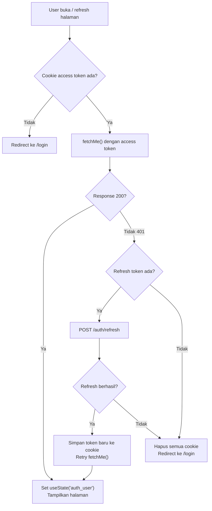
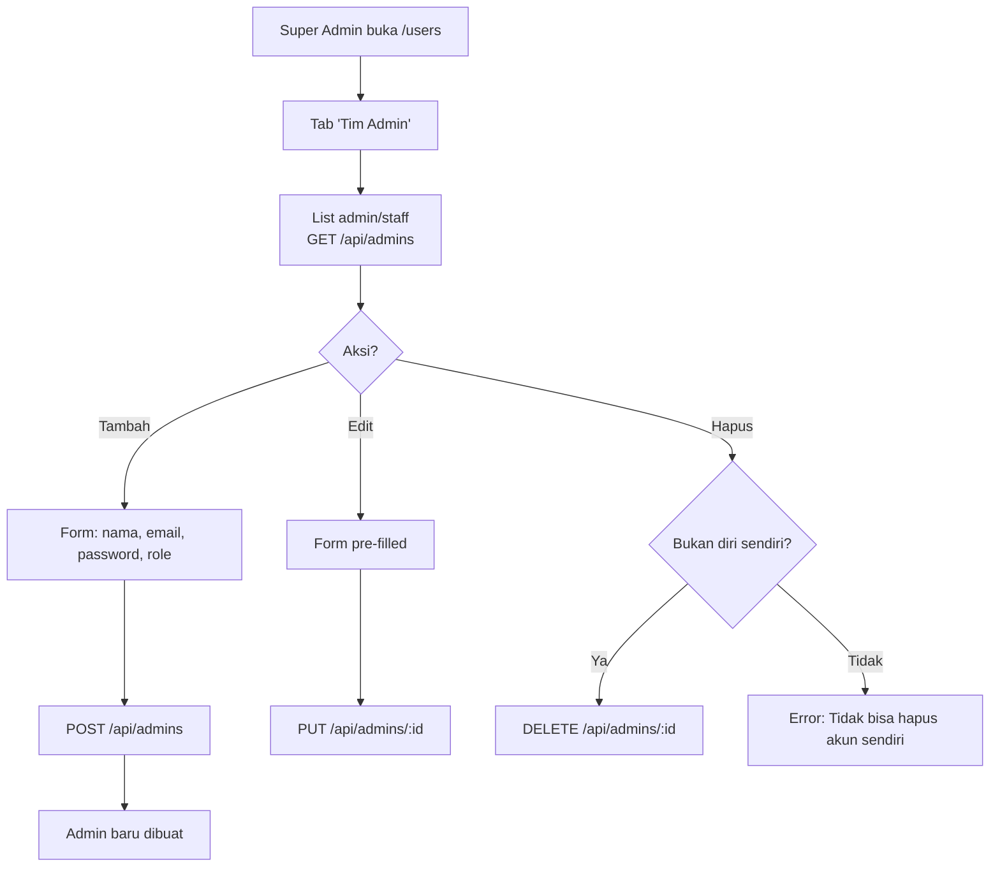
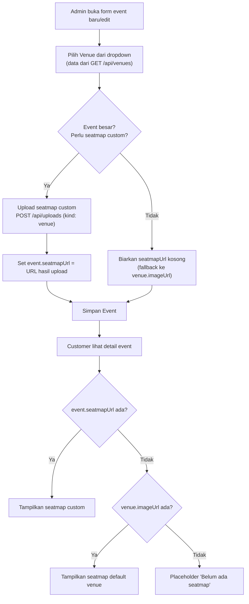

**PRD - GG Tix - Schema Enrichment, Session Persistence & Dashboard Completion**
**GGT-04 - Perbaikan Field Backend, Session/Cache, Seatmap Custom, & Halaman Users + Scanner**

| MODUL
**Backend API + Frontend Dashboard** | PERSONA
**Super Admin, Staff** | PLATFORM
**REST API (Hono + Bun) + Nuxt Frontend** | PRIORITAS
**Phase 2** | STATUS
**Draft** |
| --- | --- | --- | --- | --- |

**DACI Framework**

| **Driver** | Engineering Team |
| --- | --- |
| **Approver** | Product Owner |
| **Contributor** | Backend Developer, Frontend Developer |
| **Informed** | QA, Mobile Developer |

---

## Background Context

Backend GG Tix telah melewati Phase 1 (Foundation) dan sedang di Phase 2 (Analytics & Polish). Dari analisis menyeluruh codebase saat ini, ditemukan beberapa gap kritis antara konsep PRD dan implementasi:

1. **Missing Fields di Backend** — Beberapa field penting belum ada di database schema:
   - `ticket_categories` tidak punya kolom `benefits` (padahal frontend `CategoryManagerModal.vue` sudah punya full UI untuk input benefits, lengkap dengan TODO comment: *"Koordinasikan dengan BE untuk menambahkan kolom ini"*)
   - `events` tidak punya `description`, `endDateTime`, `tags`, `seatmapUrl`, `venueId` FK, atau `maxTicketsPerOrder`
   - Tidak ada `sortOrder` di events, venues, maupun ticket_categories
   - Venues masih punya `latitude`/`longitude` yang tidak terpakai (belum ada fitur map)

2. **Session Persistence** — Admin dashboard logout setiap kali browser di-refresh. Root cause: `useCookie` di `useApi.ts` tanpa konfigurasi `maxAge`, dan `useState('auth_user')` di-reset ke `null` saat Nuxt SSR hydration tanpa auto-restore dari cookie.

3. **Missing Dashboard Pages** — Sidebar navigasi sudah ada link ke `/users` ("Data Pelanggan") dan `/scanner` ("Scan QR Check-In"), tapi kedua halaman belum diimplementasi → 404.

4. **Venue-Event Relationship** — `events.venue` hanya string, tidak ada relasi FK ke tabel `venues`. Juga belum ada mekanisme custom seatmap per event (event besar punya layout seatmap sendiri vs event kecil pakai default dari venue).

5. **Admin/Staff Management** — Tidak ada endpoint CRUD untuk admin/staff. Super admin harus manage tim langsung di database.

---

## Problem Definition

**Apa problem / job yang dituju?**
Schema backend belum lengkap untuk mendukung kebutuhan mobile app (Phase 4) dan fitur admin yang sudah ada UI-nya. Session admin hilang saat refresh. Dua halaman dashboard belum diimplementasi.

**Siapa yang menghadapi problem ini & seberapa penting?**
- **Super Admin**: Tidak bisa input benefit tiket, deskripsi event, atau manage tim admin/staff dari dashboard. Pentingnya: **Tinggi**
- **Staff**: Tidak punya halaman scanner dan user data. Pentingnya: **Sedang**
- **Developer**: Frontend sudah punya UI tapi backend belum support (benefits, seatmap). Session bug mengganggu development. Pentingnya: **Tinggi**

**Bagaimana mereka menyelesaikannya hari ini?**
- Benefits: frontend mengirim data tapi backend mengabaikannya. Dummy data di-render kalau backend offline.
- Session: admin harus login ulang setiap kali refresh browser.
- Users/Scanner: klik sidebar → 404 error page.
- Seatmap: tidak ada fitur — admin hanya bisa upload 1 banner event via GGT-03.

**Jobs To Be Done**
- "Sebagai super admin, saya ingin menambahkan benefit per kategori tiket, supaya customer tahu keuntungan dari setiap tier."
- "Sebagai super admin, saya ingin session admin tetap aktif setelah refresh browser, supaya tidak harus login ulang setiap saat."
- "Sebagai super admin, saya ingin upload seatmap custom per event besar, supaya customer tahu layout duduk khusus event itu. Event kecil cukup pakai seatmap default venue."
- "Sebagai super admin, saya ingin menambahkan deskripsi, waktu selesai, dan tags ke event, supaya informasi event lengkap untuk mobile app."
- "Sebagai super admin, saya ingin manage tim admin/staff dari dashboard, supaya tidak harus akses database langsung."
- "Sebagai admin, saya ingin melihat daftar pelanggan yang sudah registrasi, supaya bisa monitor basis user."

---

## Scope of Work

### Backend Schema Changes

- **SCH-01** — Tambah kolom `benefits` (text[], PostgreSQL array) di `ticket_categories`
- **SCH-02** — Tambah kolom `sortOrder` (integer, default 0) di `ticket_categories`
- **SCH-03** — Tambah kolom `description` (text, opsional) di `events`
- **SCH-04** — Tambah kolom `endDateTime` (timestamp, opsional) di `events`
- **SCH-05** — Tambah kolom `maxTicketsPerOrder` (integer, default 4) di `events`
- **SCH-06** — Tambah kolom `tags` (text[], PostgreSQL array) di `events`
- **SCH-07** — Tambah kolom `seatmapUrl` (text, opsional) di `events`
- **SCH-08** — Tambah kolom `venueId` (FK ke venues.id, opsional) di `events` — menggantikan string `venue` + `city`
- **SCH-09** — Tambah kolom `sortOrder` (integer, default 0) di `events`
- **SCH-10** — Hapus kolom `latitude`/`longitude` dari `venues` (YAGNI — tidak ada fitur map)
- **SCH-11** — Tambah kolom `city` (varchar 100) di `venues`
- **SCH-12** — Tambah kolom `sortOrder` (integer, default 0) di `venues`
- **SCH-13** — Hapus kolom `venue` (string) dan `city` (string) dari `events` — data sekarang dari relasi venueId → venues

### Backend API Changes

- **API-01** — Update Zod schema & endpoint `POST /api/events/:eventId/categories` dan `PUT /api/categories/:id` untuk menerima `benefits` (string[]) dan `sortOrder` (integer)
- **API-02** — Update Zod schema & endpoint `POST /api/events` dan `PUT /api/events/:id` untuk menerima field baru: `description`, `endDateTime`, `maxTicketsPerOrder`, `tags`, `seatmapUrl`, `venueId`, `sortOrder`
- **API-03** — Hapus field `venue` (string) dan `city` (string) dari event create/update endpoints
- **API-04** — Update event list/detail response untuk include relasi venue (nama, kota, seatmap)
- **API-05** — Update venue endpoints: hapus lat/long dari create/update, tambah `city` dan `sortOrder`
- **API-06** — Endpoint baru `GET /api/admins` — list admin/staff (admin-only, paginated)
- **API-07** — Endpoint baru `POST /api/admins` — create admin/staff (super_admin-only)
- **API-08** — Endpoint baru `PUT /api/admins/:id` — update admin/staff (super_admin-only)
- **API-09** — Endpoint baru `DELETE /api/admins/:id` — delete admin/staff (super_admin-only, tidak bisa hapus diri sendiri)
- **API-10** — Endpoint baru `GET /api/customers` — list customers (admin-only, paginated, searchable)
- **API-11** — Query categories by eventId harus order by `sortOrder ASC`

### Frontend Session & Cache

- **SES-01** — Konfigurasi `useCookie` dengan `maxAge` sesuai TTL token: access token → 3600s (1h), refresh token → 604800s (7d)
- **SES-02** — Auto `fetchMe()` saat app mount jika token ada di cookie — restore `useState('auth_user')` dari backend
- **SES-03** — Middleware auth di Nuxt: redirect ke `/login` jika tidak ada token dan bukan di halaman `/login`

### Frontend Dashboard Pages

- **FE-01** — Halaman `/users` dengan 2 tab:
  - Tab "Pelanggan" — read-only list customers (search, pagination)
  - Tab "Tim Admin" — CRUD admin/staff (super admin only), list read-only untuk staff
- **FE-02** — Placeholder halaman `/scanner` — UI mockup scanner + info "QR Scanner akan diimplementasi di Phase 3 (Payment & Tickets)"
- **FE-03** — Update `EventFormModal.vue` — tambah field: description, endDateTime, tags, venueId (dropdown dari venues), seatmapUrl (upload), maxTicketsPerOrder
- **FE-04** — Update `CategoryManagerModal.vue` — tambah sortOrder (drag-reorder atau input angka)
- **FE-05** — Seatmap display logic: jika `event.seatmapUrl` ada → pakai itu. Jika `null` → fallback ke `venue.imageUrl` (default seatmap)

### Database Migration & Seed

- **MIG-01** — Drizzle migration untuk semua schema changes
- **MIG-02** — Update seed data untuk field baru (benefits, description, tags, dll)

---

## Out of Scope

- Implementasi scanner fungsional (Phase 3 — memerlukan ticket generation setelah Midtrans aktif)
- Upload payment proof / bukti bayar (menunggu Midtrans)
- Mobile app (Phase 4)
- Fitur map / geolocation venue
- Real-time notification system
- Dark mode toggle persistence

---

## Spesifikasi Field

### Ticket Categories — Field Baru

| **Field** | **Tipe / Input** | **Aturan & Batasan** | **Wajib** | **Catatan** |
| --- | --- | --- | --- | --- |
| **benefits** | text[] (PostgreSQL array) | Array string; setiap item maks 500 karakter | Tidak | Contoh: `["Best seat barisan 1-5", "Signed poster"]` |
| **sortOrder** | integer | Default 0; ascending sort (0 = pertama) | Tidak | Untuk urutan tampil: VVIP (0) > VIP (1) > Reguler (2) |

### Events — Field Baru

| **Field** | **Tipe / Input** | **Aturan & Batasan** | **Wajib** | **Catatan** |
| --- | --- | --- | --- | --- |
| **description** | text | Deskripsi event; tanpa batas panjang | Tidak | Untuk halaman detail event di mobile app |
| **endDateTime** | timestamp | Harus ≥ dateTime; ISO 8601 | Tidak | Untuk event multi-jam/multi-hari |
| **maxTicketsPerOrder** | integer | Min 1, max 10, default 4 | Tidak | Override batas hard-coded per event |
| **tags** | text[] (PostgreSQL array) | Array string; setiap tag maks 50 karakter | Tidak | Contoh: `["Genshin", "Anime", "J-Pop"]` |
| **seatmapUrl** | text (URL) | Valid URL dari `/api/uploads` | Tidak | Seatmap custom event. Jika null → fallback ke venue.imageUrl |
| **venueId** | UUID (FK → venues.id) | Harus UUID valid yang ada di tabel venues | Ya | Menggantikan string `venue` + `city` |
| **sortOrder** | integer | Default 0; ascending sort | Tidak | Urutan tampil di homepage/list |

### Events — Field Dihapus

| **Field** | **Alasan Hapus** |
| --- | --- |
| **venue** (varchar) | Digantikan oleh `venueId` FK → `venues.name` |
| **city** (varchar) | Digantikan oleh `venueId` FK → `venues.city` |

### Venues — Field Baru

| **Field** | **Tipe / Input** | **Aturan & Batasan** | **Wajib** | **Catatan** |
| --- | --- | --- | --- | --- |
| **city** | varchar(100) | Nama kota venue | Ya | Contoh: "Jakarta", "Surabaya" |
| **sortOrder** | integer | Default 0; ascending sort | Tidak | Urutan tampil di list |

### Venues — Field Dihapus

| **Field** | **Alasan Hapus** |
| --- | --- |
| **latitude** | YAGNI — tidak ada fitur map di roadmap dekat |
| **longitude** | YAGNI — tidak ada fitur map di roadmap dekat |

### Admin Endpoints — Field

| **Field** | **Tipe / Input** | **Aturan & Batasan** | **Wajib** | **Catatan** |
| --- | --- | --- | --- | --- |
| **name** | varchar(100) | Min 2 karakter | Ya | Nama admin/staff |
| **email** | varchar(150) | Valid email, unique | Ya | Email login |
| **password** | string | Min 6 karakter; hanya untuk create | Ya (create) | Hash dengan Bun.password.hash |
| **role** | enum | `super_admin` atau `staff` | Ya | Role admin |

---

## State [Session Persistence] (Analisis Kode)

| **Komponen / State** | **Kondisi / Data** | **Perilaku Saat Ini (Bug)** | **Perilaku Target** |
| --- | --- | --- | --- |
| `useApi.ts` — `useCookie('ggtix_access_token')` | Token ada di cookie | Cookie tanpa `maxAge` → hilang saat sesi browser | Cookie dengan `maxAge: 3600` (1h) |
| `useApi.ts` — `useCookie('ggtix_refresh_token')` | Refresh token ada di cookie | Cookie tanpa `maxAge` → hilang saat sesi browser | Cookie dengan `maxAge: 604800` (7d) |
| `useAuth.ts` — `useState('auth_user')` | User data | Reset ke `null` saat SSR hydration | Auto `fetchMe()` saat mount jika token ada |
| `app.vue` / `default.vue` | App mount | Tidak ada pengecekan session | Middleware: cek token → fetchMe() → redirect jika invalid |

---

## State [Seatmap Display Logic]

| **Komponen / State** | **Kondisi / Data** | **Perilaku** | **Aksi** |
| --- | --- | --- | --- |
| **Event Detail** | `event.seatmapUrl` !== null | Tampilkan seatmap custom event | Render `` |
| **Event Detail** | `event.seatmapUrl` === null, `venue.imageUrl` !== null | Tampilkan seatmap default venue | Render `` |
| **Event Detail** | Keduanya null | Tampilkan placeholder | Render placeholder icon "Belum ada seatmap" |
| **Event Form** | Upload seatmap | Upload via `/api/uploads` (kind: `venue`) | Simpan URL ke `events.seatmapUrl` |

---

## Forecasted Impact Metrics

- **Session persistence** → 0 logout-on-refresh bug (sebelumnya: 100% refresh = logout)
- **Schema enrichment** → 100% benefit data tersimpan di BE (sebelumnya: 0%, frontend-only dummy)
- **Dashboard completion** → 0 dead links di sidebar (sebelumnya: 2 halaman → 404)
- **Admin management** → Super admin bisa CRUD staff tanpa akses database langsung
- **Event detail completeness** → Event punya description, tags, seatmap — siap untuk mobile app Phase 4

---

## User Flow

### Alur Session Persistence

Langkah ringkas: (1) User buka/refresh halaman. (2) Nuxt middleware cek cookie token. (3) Jika ada, auto fetchMe(). (4) Jika valid, lanjut ke halaman. Jika expired, coba refresh token. Jika gagal, redirect login.

### Alur Manage Admin/Staff

Langkah ringkas: (1) Super admin buka halaman /users. (2) Pilih tab "Tim Admin". (3) Klik "Tambah Admin". (4) Isi form (nama, email, password, role). (5) Submit → POST /api/admins. (6) Admin baru muncul di list.

### Alur Seatmap Custom per Event

Langkah ringkas: (1) Super admin buka form event. (2) Pilih venue dari dropdown. (3) Opsional: upload seatmap custom. (4) Simpan event. (5) Customer lihat detail event → seatmap custom (jika ada) atau default venue.

---

## User Stories & Acceptance Criteria

| **User Story** | **Acceptance Criteria** | **Est Points** | **Notes** |
| --- | --- | --- | --- |
| Sebagai super admin, saya ingin menambahkan benefit per kategori tiket agar customer tahu keuntungan tiap tier. | - Bisa input list benefit (tambah/hapus) di form kategori - Benefits tersimpan di database - Benefits muncul di response GET categories - Frontend render benefits dari BE (bukan dummy) | 3 | SCH-01, API-01 |
| Sebagai super admin, saya ingin mengatur urutan tampil kategori tiket. | - Ada field sortOrder di form kategori - Categories di-sort by sortOrder ASC di response - Default sortOrder = 0 | 2 | SCH-02, API-11 |
| Sebagai super admin, saya ingin menambahkan deskripsi dan tags ke event. | - Form event punya field description (textarea) dan tags (chip input) - Data tersimpan di DB dan muncul di response | 3 | SCH-03, SCH-06, API-02, FE-03 |
| Sebagai super admin, saya ingin set waktu selesai event. | - Form event punya field endDateTime (datetime-local) - Validasi endDateTime ≥ dateTime | 2 | SCH-04, API-02, FE-03 |
| Sebagai super admin, saya ingin mengatur batas pembelian tiket per event. | - Form event punya field maxTicketsPerOrder (number input, default 4) - Validasi min 1, max 10 | 2 | SCH-05, API-02, FE-03 |
| Sebagai super admin, saya ingin upload seatmap custom per event besar. | - Form event punya upload seatmap (via /api/uploads) - Jika kosong, frontend fallback ke venue.imageUrl - Upload kind = venue (9:16 ratio) | 3 | SCH-07, FE-03, FE-05 |
| Sebagai super admin, saya ingin memilih venue dari master data. | - Form event punya dropdown venue (dari GET /api/venues) - Field venue (string) dan city dihapus dari events - Event detail response include venue data | 5 | SCH-08, SCH-13, API-02, API-03, API-04, FE-03 |
| Sebagai admin, saya ingin session tetap aktif setelah refresh browser. | - Cookie token punya maxAge sesuai TTL - Auto fetchMe() saat mount jika token ada - Tidak logout saat refresh | 3 | SES-01, SES-02, SES-03 |
| Sebagai super admin, saya ingin manage tim admin/staff dari dashboard. | - Halaman /users tab "Tim Admin" - Super admin bisa create/edit/delete admin/staff - Tidak bisa hapus akun sendiri - Staff hanya bisa lihat list | 5 | API-06–09, FE-01 |
| Sebagai admin, saya ingin melihat daftar pelanggan dari dashboard. | - Halaman /users tab "Pelanggan" - Read-only list customers dengan search + pagination | 3 | API-10, FE-01 |
| Sebagai admin, saya ingin placeholder scanner page agar sidebar tidak 404. | - Halaman /scanner exist - Tampilkan UI mockup + info Phase 3 | 1 | FE-02 |
| Sebagai super admin, saya ingin venue punya data kota dan urutan. | - Venue punya field city (wajib) dan sortOrder - lat/long dihapus dari schema | 2 | SCH-10, SCH-11, SCH-12, API-05 |

---

## Wording (Microcopy)

| **Kondisi / Field** | **Wording (Bahasa Indonesia)** | **Catatan** |
| --- | --- | --- |
| **Scanner placeholder** | "Fitur Scan QR Check-In akan tersedia setelah integrasi pembayaran Midtrans selesai (Phase 3)." | Halaman /scanner |
| **Seatmap upload label** | "Seatmap Custom (Opsional)" | Form event |
| **Seatmap fallback info** | "Menggunakan seatmap default dari venue." | Jika seatmapUrl null |
| **Benefit input** | "Tekan Enter atau klik + untuk menambah benefit." | Form kategori |
| **maxTicketsPerOrder** | "Batas Pembelian per Order" | Form event |
| **Hapus admin error** | "Tidak dapat menghapus akun Anda sendiri." | Validasi DELETE /api/admins/:id |
| **Session expired** | "Sesi Anda telah berakhir. Silakan login kembali." | Auto-redirect ke login |
| **Tags input** | "Tambahkan tag untuk memudahkan pencarian event (contoh: Genshin, Anime)." | Form event |
| **Description** | "Deskripsi Event (untuk halaman detail di mobile app)" | Form event |
| **Tab Pelanggan** | "Pelanggan" | Tab /users |
| **Tab Tim Admin** | "Tim Admin" | Tab /users |

---

> **Dependency antar modul:**
> - SCH-08 (venueId FK) memerlukan tabel venues yang sudah ada (GGT-03 sudah mengimplementasikan CRUD venues)
> - SCH-13 (hapus venue/city string) memerlukan SCH-08 selesai dan migrasi data existing ke venueId
> - FE-05 (seatmap fallback) memerlukan SCH-07 dan SCH-08
> - FE-01 (halaman users) memerlukan API-06 sampai API-10
> - SES-01—SES-03 tidak ada dependency backend — murni frontend changes
> - MIG-01 harus dijalankan sebelum semua perubahan lainnya

> **Catatan penutup:** Dokumen ini adalah bagian dari seri PRD GG Tix. Acuan utama: [GG Tix — Dokumen Konsep Lengkap](file:///home/artdi/Projects/GG%20Tix/prd/GG%20Tix%20-%20Dokumen%20Konsep%20Lengkap.md). Semua scope field baru, seatmap custom, dan session persistence sudah divalidasi melalui interview dengan product owner. Sebelum kickoff, pastikan: (1) migration script sudah di-review, (2) seed data diupdate, (3) Dokumen Konsep Lengkap diupdate untuk reflect schema changes.
