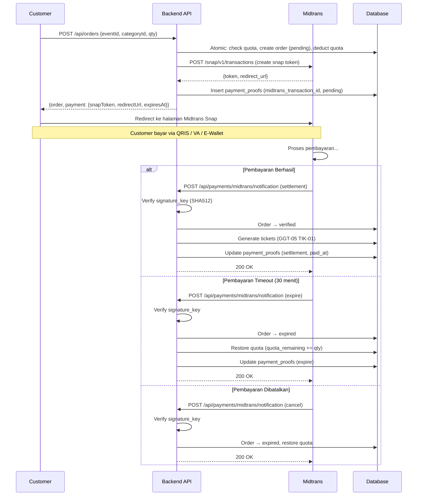

**PRD - GG Tix - Midtrans Payment Gateway Integration**
**GGT-06 - Integrasi Pembayaran Otomatis Midtrans Snap, Webhook, & Auto-Verification**

| MODUL                                      | PERSONA                                | PLATFORM                                        | PRIORITAS         | STATUS          |
| ------------------------------------------ | -------------------------------------- | ----------------------------------------------- | ----------------- | --------------- |
| **Backend API + Frontend Dashboard** | **Customer, Super Admin, Staff** | **REST API (Hono + Bun) + Nuxt Frontend** | **Phase 3** | **Draft** |

**DACI Framework**

| **Driver**      | Engineering Team                      |
| --------------------- | ------------------------------------- |
| **Approver**    | Product Owner                         |
| **Contributor** | Backend Developer, Frontend Developer |
| **Informed**    | QA, Mobile Developer, Finance         |

---

## Background Context

Saat ini flow pembayaran GG Tix masih **manual verification**:

1. Customer membuat order → status `pending`.
2. Admin secara manual klik "Verify" atau "Reject" di dashboard `/orders`.
3. Tidak ada mekanisme pembayaran otomatis, konfirmasi, atau timeout.

**Masalah yang ditimbulkan**:

- Customer harus menunggu admin memverifikasi manual (bisa lama, terutama di luar jam kerja).
- Tidak ada batas waktu pembayaran — tiket bisa di-hold (kuota terkunci) tanpa batas oleh order pending.
- Tidak ada bukti pembayaran terstruktur — admin memverifikasi "berdasarkan kepercayaan".
- Tidak scalable untuk volume tinggi (war tiket ratusan order per menit).

**Solusi**: Integrasi **Midtrans Snap** sebagai payment gateway otomatis. Customer membayar → Midtrans mengirim webhook → backend otomatis memverifikasi order dan men-generate tiket (via logic GGT-05).

---

## Problem Definition

**Apa masalah yang dituju?**
Proses pembayaran tiket masih manual dan tidak ada mekanisme auto-verification. Order pending bisa menahan kuota tiket tanpa batas waktu.

**Siapa yang terdampak?**

- **Customer**: Harus menunggu admin manual verify, tidak tahu kapan tiket terbit. **Kritis**.
- **Admin**: Harus monitor dan verify order satu per satu, terutama saat volume tinggi. **Tinggi**.
- **Bisnis**: Kuota tiket terkunci oleh order pending yang tidak pernah dibayar. **Tinggi**.

**Jobs To Be Done**

- *"Sebagai customer, setelah memilih tiket dan jumlah, saya ingin diarahkan ke halaman pembayaran aman dan tiket saya terbit otomatis setelah bayar."*
- *"Sebagai admin, saya ingin order yang sudah dibayar otomatis terverifikasi tanpa perlu intervensi manual."*
- *"Sebagai admin, saya ingin order yang tidak dibayar dalam 30 menit otomatis expired dan kuotanya kembali."*

---

## Scope of Work

### PAY-01 — Schema Migration: Tambah Status Order `expired`

**Perubahan enum `order_status`**:

```
pending → verified | rejected | expired
```

- `verified`: Pembayaran berhasil (via Midtrans webhook atau manual admin).
- `rejected`: Ditolak oleh admin secara manual.
- `expired`: Pembayaran timeout (30 menit) — kuota dikembalikan otomatis.

**Drizzle schema update** di `backend/src/db/schema.ts`:

```typescript
export const orderStatusEnum = pgEnum("order_status", [
  "pending",
  "verified",
  "rejected",
  "expired",   // NEW
]);
```

**Migration SQL**:

```sql
ALTER TYPE order_status ADD VALUE 'expired';
```

---

### PAY-02 — Schema Migration: Enrich Tabel `payment_proofs`

Tabel `payment_proofs` yang sudah ada diubah menjadi log pembayaran umum:

**Kolom baru**:

| Kolom                       | Tipe         | Nullable | Deskripsi                                                                     |
| --------------------------- | ------------ | -------- | ----------------------------------------------------------------------------- |
| `midtrans_transaction_id` | varchar(100) | Ya       | Transaction ID dari Midtrans                                                  |
| `payment_type`            | varchar(50)  | Ya       | Jenis pembayaran:`bank_transfer`, `qris`, `gopay`, `shopeepay`        |
| `transaction_status`      | varchar(30)  | Ya       | Status Midtrans:`settlement`, `pending`, `expire`, `cancel`, `deny` |
| `midtrans_response`       | jsonb        | Ya       | Raw JSON response dari Midtrans (untuk audit trail)                           |
| `paid_at`                 | timestamp    | Ya       | Waktu pembayaran berhasil (dari Midtrans`transaction_time`)                 |

**Drizzle schema**:

```typescript
export const paymentProofs = pgTable("payment_proofs", {
  id: uuid("id").defaultRandom().primaryKey(),
  orderId: uuid("order_id")
    .notNull()
    .references(() => orders.id, { onDelete: "cascade" }),
  imageUrl: text("image_url"),  // nullable sekarang (tidak wajib untuk Midtrans)
  midtransTransactionId: varchar("midtrans_transaction_id", { length: 100 }),
  paymentType: varchar("payment_type", { length: 50 }),
  transactionStatus: varchar("transaction_status", { length: 30 }),
  midtransResponse: jsonb("midtrans_response"),
  paidAt: timestamp("paid_at"),
  uploadedAt: timestamp("uploaded_at").notNull().defaultNow(),
});
```

---

### PAY-03 — Backend: Endpoint Inisiasi Pembayaran (Create Snap Token)

**Endpoint**: `POST /api/payments/midtrans/token`

**Auth**: 🟣 Customer.

**Request Body**:

```jsonc
{
  "orderId": "uuid"
}
```

**Logic**:

1. Validasi order milik customer yang sedang login.
2. Validasi order status = `pending`.
3. Panggil Midtrans Snap API (`POST https://app.sandbox.midtrans.com/snap/v1/transactions`):

```jsonc
{
  "transaction_details": {
    "order_id": "GGTIX-<orderId-short>-<timestamp>",
    "gross_amount": 1500000
  },
  "customer_details": {
    "first_name": "Sari",
    "email": "sari@example.com"
  },
  "item_details": [
    {
      "id": "category-uuid",
      "price": 750000,
      "quantity": 2,
      "name": "VIP - Wuthering Waves Live 2026"
    }
  ],
  "expiry": {
    "unit": "minutes",
    "duration": 30
  },
  "enabled_payments": [
    "bank_transfer", "echannel", "bca_va", "bni_va", "bri_va", "permata_va",
    "qris", "gopay", "shopeepay"
  ]
}
```

4. Simpan `midtrans_transaction_id` ke `payment_proofs`.

**Response** (201):

```jsonc
{
  "data": {
    "orderId": "uuid",
    "snapToken": "66e4fa55-fdac-4ef9-91b5-733b97d1b862",
    "redirectUrl": "https://app.sandbox.midtrans.com/snap/v4/redirection/66e4fa55-...",
    "expiresAt": "2026-08-15T15:00:00.000Z"
  }
}
```

**Error Responses**:

| Kondisi                                       | Status | Error                         |
| --------------------------------------------- | ------ | ----------------------------- |
| Order tidak ditemukan                         | 404    | `ORDER_NOT_FOUND`           |
| Order bukan milik customer                    | 403    | `FORBIDDEN`                 |
| Order bukan`pending`                        | 409    | `ORDER_NOT_PENDING`         |
| Order sudah punya snap token yang masih valid | 409    | `PAYMENT_ALREADY_INITIATED` |

---

### PAY-04 — Backend: Webhook Handler Midtrans

**Endpoint**: `POST /api/payments/midtrans/notification`

**Auth**: 🟢 Public (dari Midtrans server, divalidasi via signature).

**Keamanan Webhook — Signature Key Verification**:

```
signature_key = SHA512(order_id + status_code + gross_amount + server_key)
```

Backend **wajib** memverifikasi `signature_key` dari payload Midtrans sebelum memproses. Jika tidak cocok → `403 Forbidden`.

**Payload Midtrans** (contoh settlement):

```jsonc
{
  "transaction_time": "2026-08-15 14:30:00",
  "transaction_status": "settlement",
  "transaction_id": "513f1f01-c9da-474c-9fc9-d5c64364b709",
  "status_code": "200",
  "signature_key": "fe...",
  "payment_type": "qris",
  "order_id": "GGTIX-a3f8b2c1-1723718400",
  "gross_amount": "1500000.00",
  "fraud_status": "accept"
}
```

**Logic per `transaction_status`**:

| Midtrans Status                             | Aksi Backend                                                                     |
| ------------------------------------------- | -------------------------------------------------------------------------------- |
| `settlement` / `capture` (fraud=accept) | Order →`verified`, generate tiket (GGT-05 TIK-01 logic), simpan payment proof |
| `pending`                                 | Tidak ubah status order, update payment proof status saja                        |
| `expire`                                  | Order →`expired`, kembalikan kuota (`quota_remaining += quantity`)          |
| `cancel` / `deny`                       | Order →`expired`, kembalikan kuota                                            |

**Response ke Midtrans**: Selalu `200 OK` `{ "status": "ok" }` agar Midtrans tidak retry.

**Idempotency**: Jika order sudah `verified` / `expired` / `rejected`, abaikan webhook (jangan proses ulang).

**File baru**:

- `backend/src/routes/payments.ts`
- `backend/src/services/payment.service.ts`
- `backend/src/lib/midtrans.ts` — helper untuk Snap API call dan signature verification.

---

### PAY-05 — Backend: Konfigurasi & Helper Midtrans

**Environment Variables** (tambahan di `.env`):

```
MIDTRANS_SERVER_KEY=SB-Mid-server-xxxxxxxxxxxx
MIDTRANS_CLIENT_KEY=SB-Mid-client-xxxxxxxxxxxx
MIDTRANS_IS_PRODUCTION=false
```

**Helper `backend/src/lib/midtrans.ts`**:

```typescript
const MIDTRANS_BASE_URL = process.env.MIDTRANS_IS_PRODUCTION === 'true'
  ? 'https://app.midtrans.com/snap/v1'
  : 'https://app.sandbox.midtrans.com/snap/v1';

export async function createSnapTransaction(params: SnapParams): Promise<SnapResponse> {
  const response = await fetch(`${MIDTRANS_BASE_URL}/transactions`, {
    method: 'POST',
    headers: {
      'Content-Type': 'application/json',
      'Authorization': `Basic ${btoa(process.env.MIDTRANS_SERVER_KEY + ':')}`,
    },
    body: JSON.stringify(params),
  });
  return response.json();
}

export function verifySignature(
  orderId: string,
  statusCode: string,
  grossAmount: string,
  signatureKey: string
): boolean {
  const serverKey = process.env.MIDTRANS_SERVER_KEY!;
  const payload = orderId + statusCode + grossAmount + serverKey;
  const hash = new Bun.CryptoHasher("sha512").update(payload).digest("hex");
  return hash === signatureKey;
}
```

**Startup Validation**: Fail-fast jika `MIDTRANS_SERVER_KEY` tidak di-set:

```typescript
export function assertMidtransConfigured() {
  if (!process.env.MIDTRANS_SERVER_KEY) {
    console.warn('MIDTRANS_SERVER_KEY not set — payment features disabled');
  }
}
```

> **Catatan**: Payment features bersifat **opsional** — jika env vars tidak diset, endpoint payment akan return error tapi seluruh sistem lain tetap berjalan normal. Admin tetap bisa manual verify.

---

### PAY-06 — Backend: Auto-Expire Order Pending (Scheduled Job)

**Mekanisme**: Selain mengandalkan webhook `expire` dari Midtrans, backend juga menjalankan pengecekan periodik untuk order yang sudah melewati batas waktu.

**Logic**:

1. Query semua order dengan status `pending` yang `created_at` lebih dari 30 menit lalu.
2. Untuk setiap order tersebut:
   - Update status → `expired`.
   - Kembalikan kuota (`quota_remaining += quantity`).
3. Log jumlah order yang di-expire.

**Implementasi**: Endpoint internal `POST /api/payments/expire-pending` (🔴 Super Admin) yang bisa dipanggil secara manual atau via cron job eksternal.

**Alternatif**: Bisa juga dijalankan sebagai `setInterval` di backend saat startup, misal setiap 5 menit cek dan expire order pending yang sudah timeout.

---

### PAY-07 — Frontend Admin: Update Halaman Orders

**Perubahan di `frontend/app/pages/orders/index.vue`**:

1. **Filter status**: Tambah opsi `expired` di dropdown filter status (sekarang: pending, verified, rejected, **expired**).
2. **Badge status**: Warna badge baru:

   - `pending` → Kuning/Amber
   - `verified` → Hijau
   - `rejected` → Merah
   - `expired` → Abu-abu
3. **Kolom Payment Info** (baru):

   - Tampilkan `paymentType` jika ada (misal: "QRIS", "BCA VA", "GoPay").
   - Tampilkan `paidAt` jika status verified via Midtrans.
   - Jika order pending & punya Midtrans redirect URL, tampilkan link "Lihat Payment".
4. **Detail Order** (expandable row atau modal):

   - Tampilkan `midtransTransactionId` jika ada.
   - Tampilkan countdown timer untuk order pending (sisa waktu dari 30 menit).
5. **Tombol Verify/Reject tetap ada** — sebagai fallback manual sesuai keputusan desain.

---

### PAY-08 — Backend: Update Create Order Flow

**Perubahan di `POST /api/orders`**:

Saat order berhasil dibuat, response sekarang menyertakan informasi untuk redirect ke Midtrans (jika `MIDTRANS_SERVER_KEY` tersedia):

**Response Baru** (201):

```jsonc
{
  "message": "Order created successfully",
  "data": {
    "id": "uuid",
    "status": "pending",
    "totalPrice": "1500000.00",
    "quantity": 2,
    "createdAt": "..."
  },
  "payment": {                           // NEW — hanya ada jika Midtrans configured
    "snapToken": "66e4fa55-...",
    "redirectUrl": "https://app.sandbox.midtrans.com/snap/v4/redirection/66e4fa55-...",
    "expiresAt": "2026-08-15T15:00:00.000Z"
  }
}
```

Jika `MIDTRANS_SERVER_KEY` tidak tersedia, field `payment` tidak ada di response (backward compatible — tetap bisa manual verify seperti sebelumnya).

---

## Endpoint Summary (GGT-06)

| Method | Path                                    | Auth             | Deskripsi                           |
| ------ | --------------------------------------- | ---------------- | ----------------------------------- |
| POST   | `/api/payments/midtrans/token`        | Customer         | Inisiasi Snap token & redirect URL  |
| POST   | `/api/payments/midtrans/notification` | Public (webhook) | Handler notifikasi Midtrans         |
| POST   | `/api/payments/expire-pending`        | Super Admin      | Manual trigger expire order timeout |

---

## Diagram Flow Pembayaran



---

## Verification Plan

### Automated Tests (Sandbox)

```bash
# 1. Create order (sekarang return payment info)
curl -X POST http://localhost:3000/api/orders \
  -H "Authorization: Bearer <customerToken>" \
  -H "Content-Type: application/json" \
  -d '{"eventId": "<id>", "categoryId": "<id>", "quantity": 2}'
# Response harus ada field "payment.redirectUrl"

# 2. Simulate settlement webhook (dari Midtrans sandbox simulator)
curl -X POST http://localhost:3000/api/payments/midtrans/notification \
  -H "Content-Type: application/json" \
  -d '{"order_id":"GGTIX-...", "transaction_status":"settlement", "signature_key":"...", ...}'
# Cek order status → verified, tiket ter-generate

# 3. Simulate expire webhook
curl -X POST http://localhost:3000/api/payments/midtrans/notification \
  -H "Content-Type: application/json" \
  -d '{"order_id":"GGTIX-...", "transaction_status":"expire", "signature_key":"...", ...}'
# Cek order status → expired, quota kembali

# 4. Test signature verification (invalid signature → 403)
# 5. Test idempotency (kirim webhook yang sama 2x → tidak error, tidak double process)
```

### Manual Verification

1. Buat order → buka `redirectUrl` di browser → bayar via QRIS sandbox → cek order auto-verified.
2. Buat order → tunggu 30 menit (atau trigger expire) → cek order auto-expired & quota kembali.
3. Cek halaman `/orders` di admin dashboard → badge `expired` muncul dengan warna abu-abu.
4. Test manual verify masih berjalan normal (sebagai fallback).

---

## Acceptance Criteria

- [ ] Enum `order_status` memiliki nilai `expired`
- [ ] Tabel `payment_proofs` memiliki kolom Midtrans enrichment
- [ ] `POST /api/orders` menyertakan `payment.redirectUrl` jika Midtrans configured
- [ ] `POST /api/payments/midtrans/token` membuat Snap token untuk order pending
- [ ] Webhook handler memvalidasi signature_key sebelum proses
- [ ] Settlement webhook → order `verified` + tiket ter-generate (via GGT-05)
- [ ] Expire/cancel webhook → order `expired` + kuota dikembalikan
- [ ] Webhook handler idempotent (tidak double-process)
- [ ] Auto-expire job untuk order pending yang melewati 30 menit
- [ ] Admin tetap bisa manual verify/reject sebagai fallback
- [ ] Halaman orders menampilkan status `expired` dengan badge abu-abu
- [ ] Halaman orders menampilkan info payment type & paid_at
- [ ] Sistem tetap berjalan normal tanpa `MIDTRANS_SERVER_KEY` (graceful degradation)
- [ ] Timeout pembayaran = 30 menit
- [ ] Metode bayar: VA (BCA/BNI/BRI/Mandiri/Permata), QRIS, GoPay, ShopeePay

---

## Dependency

- **GGT-05 (TIK-01)**: Logic auto-generate tiket saat order verified. GGT-06 memanggil logic yang sama saat webhook `settlement` diterima.

---

> **Referensi Terkait:**
>
> - [GG Tix — Dokumen Konsep Lengkap](<file:///home/artdi/Projects/GG%20Tix/prd/GG%20Tix%20-%20Dokumen%20Konsep%20Lengkap.md>)
> - [Backend API Contract](<file:///home/artdi/Projects/GG%20Tix/prd/Backend%20API%20Contract%20-%20Panduan%20Integrasi%20Frontend.md>)
> - [GGT-05: Digital Ticket &amp; QR Check-In](<file:///home/artdi/Projects/GG%20Tix/prd/GGT-05%20-%20Digital%20Ticket%20Generation%20&%20QR%20Check-In%20System.md>)
> - [Midtrans Snap API Docs](https://docs.midtrans.com/reference/snap-api)
