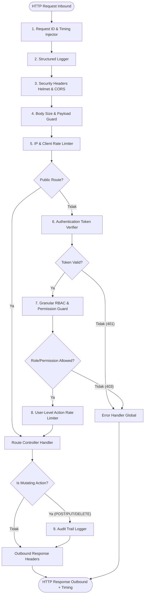

**PRD - GG Tix - Modul Middleware & Request Pipeline**  
**GGT-07 - Unified Middleware Architecture, RBAC & API Gatekeeping System**

| MODUL | PERSONA | PLATFORM | PRIORITAS | STATUS |
| --- | --- | --- | --- | --- |
| **Backend & Frontend Middleware** | **Developer, Security Engineer, Super Admin, Staff, Customer** | **REST API (Hono + Bun) + Nuxt 4 Route Engine** | **Phase 3 — High** | **Draft** |

**DACI Framework**

| **Driver** | Engineering Team |
| --- | --- |
| **Approver** | Product Owner & Technical Architect |
| --- | --- |
| **Contributor** | Backend Developer, Frontend Developer, DevOps / SecOps |
| --- | --- |
| **Informed** | QA Team, Project Manager, Security Auditor |

---

## Background Context

GG Tix telah menyelesaikan pengembangan modul inti transaksi tiket, visual analytics, penyimpanan media terdistribusi (Backblaze B2), sistem check-in scanner (QR gate check-in), serta gateway pembayaran Midtrans. Namun, seiring dengan meningkatnya kompleksitas sistem dan persiapan rilis skala publik, arsitektur *middleware* yang bertindak sebagai gerbang utama (*gatekeeper*) aplikasi membutuhkan standarisasi dan penguatan menyeluruh:

1. **Ketiadaan Request Tracing & Correlation ID**: Setiap request yang masuk belum memiliki `X-Request-ID` unik yang diteruskan dari frontend ke backend dan tercatat di database error log, menyulitkan proses debugging insiden di production.
2. **Ketiadaan Security Headers (HTTP Hardening)**: API server belum menerapkan header keamanan standar industri seperti `Content-Security-Policy`, `X-Content-Type-Options: nosniff`, `X-Frame-Options: DENY`, `Strict-Transport-Security` (HSTS), dan `Referrer-Policy`.
3. **Penyimpanan Rate Limit Rentan Memory Leak**: Implementasi `rateLimit` saat ini menggunakan `Map<string, RateLimitBucket>` in-memory tanpa mekanisme *automatic garbage collection / TTL sweeper* untuk membersihkan IP bucket yang sudah kedaluwarsa, serta belum mendukung pembatasan berbasis *User ID* (hanya berbasis IP).
4. **Otorisasi Belum Granular (RBAC Fleksibel)**: RBAC saat ini masih terikat pada fungsi statis (`adminOnly`, `superAdminOnly`, `customerOnly`) tanpa kemampuan deklaratif untuk membatasi endpoint berdasarkan aksi spesifik (misal: *Scanner Staff* hanya boleh check-in dan melihat statistik event, tidak boleh mengubah data artis/venue).
5. **Ketiadaan Audit Logging untuk Aksi Sensitif**: Aksi administratif krusial (verifikasi order manual, penghapusan venue/event, penambahan role admin) belum tercatat secara terstruktur dalam sistem audit trail middleware.
6. **Frontend Route Guard Belum Memvalidasi Hak Akses Role**: Middleware frontend (`auth.global.ts`) baru memvalidasi status autentikasi token, belum mencegah akun non-Super Admin mengakses halaman kelola tim admin.

Dokumen ini menjadi cetak biru (*blueprint*) rekayasa perangkat lunak untuk standarisasi, refactoring, dan penguatan pipa middleware (*request-response pipeline*) di seluruh ekosistem GG Tix.

---

## Problem Definition

**Apa problem / job yang dituju?**  
Infrastruktur middleware saat ini belum terintegrasi secara holistik untuk menjamin keamanan level tinggi, pelacakan request end-to-end, pencegahan kebocoran memori pada rate limiter, otorisasi peran berbasis aksi yang granular, dan audit trail aksi krusial.

**Siapa yang menghadapi problem ini & seberapa penting?**  
- **Tim Engineering & DevOps**: Sulit menelusuri akar masalah bug transaksi dan serangan brute-force tanpa trace ID dan audit log. (**Kritis**)
- **Staff & Super Admin**: Risiko pembobolan akun internal atau kebocoran data akibat ketiadaan security headers dan granular role guard. (**Tinggi**)
- **Customer & Konsumen**: Membutuhkan kepastian ketersediaan layanan (*uptime*) tanpa down akibat serangan DoS atau abuse kuota. (**Kritis**)

**Bagaimana mereka menyelesaikannya hari ini?**  
Pengecekan log server dilakukan secara manual dari console stdout tanpa korelasi ID, validasi role tersebar parsial di setiap handler route, dan pembersihan memori rate limit bergantung pada restart server.

**Jobs To Be Done**  
• *"Sebagai developer/SecOps, saya ingin setiap request memiliki Request ID unik dan tercatat waktu eksekusinya, agar investigasi insiden dan performa dapat dilacak seketika."*  
• *"Sebagai super admin, saya ingin aksi staf admin dan perubahan data krusial tercatat dalam audit log, agar akuntabilitas operasional terjamin."*  
• *"Sebagai pengguna sistem, saya ingin rate limiter membersihkan memori secara otomatis dan tidak memblokir IP proxy tepercaya, agar aplikasi tetap stabil dan cepat."*  
• *"Sebagai staff gate/scanner, saya hanya ingin mengakses fitur scanner tanpa risiko mengakses modul konfigurasi finansial dan master data."*

---

## Scope of Work

• **MID-01 (Request Traceability & Metrics)**: Middleware `requestId` generator (UUID v4 / nanoid) yang menyuntikkan `X-Request-ID` dan `X-Response-Time` pada response header dan context logger.  
• **MID-02 (Security Headers Enforcement)**: Middleware keamanan HTTP (`secureHeaders`) untuk memitigasi XSS, clickjacking, MIME sniffing, dan protocol downgrade.  
• **MID-03 (Advanced Sliding-Window Rate Limiter & GC)**: Refactoring `rateLimit` dengan mekanisme *Sliding Log / Window*, background periodic memory cleanup (sweeper interval), dan proteksi multi-tier (IP-based + User ID-based).  
• **MID-04 (Granular RBAC & Permission Matrix Middleware)**: Middleware deklaratif `requirePermission(action, resource)` yang memetakan role (`super_admin`, `staff_event`, `staff_gate`, `customer`) ke perizinan spesifik.  
• **MID-05 (Body & Stream Safety Guard)**: Penguatan middleware `bodySizeLimit` dengan deteksi MIME-type yang ketat dan pencegahan payload injection.  
• **MID-06 (Structured Audit Trail Logging Middleware)**: Interceptor middleware otomatis untuk mencatat mutasi state penting (POST/PUT/PATCH/DELETE pada data sensitif) ke audit log store.  
• **MID-07 (Frontend Route & RBAC Guard Pipeline)**: Pengayaan Nuxt Route Middleware (`auth.global.ts` & `rbac.global.ts`) dengan proteksi halaman berbasis role user secara reaktif.

---

## Out of Scope

• Implementasi Hardware Web Application Firewall (WAF) eksternal seperti Cloudflare Enterprise / AWS WAF.  
• Migrasi database session ke OAuth2 / OpenID Connect Identity Provider pihak ketiga (Google/Apple SSO).  
• Implementasi e-mail notification trigger langsung dari middleware.  
• Captcha verification widget pihak ketiga (misal: hCaptcha/reCAPTCHA).

---

## Spesifikasi Field & Parameter Konfigurasi

| Parameter / Field | Tipe / Sumber | Aturan & Batasan | Default | Wajib | Catatan |
| --- | --- | --- | --- | --- | --- |
| **`REQUEST_ID_HEADER`** | Config String | Format nama header HTTP | `X-Request-ID` | Ya | Digunakan oleh client & server |
| **`ENABLE_SECURITY_HEADERS`** | Boolean (Env) | `true` atau `false` | `true` | Ya | Mengaktifkan helmet-grade headers |
| **`HSTS_MAX_AGE`** | Number (Detik) | Minimal 15552000 (180 hari) | `31536000` (1 thn) | Ya | Hanya aktif pada HTTPS |
| **`CSP_POLICY`** | String (Policy) | Directive Content Security Policy | Restricted | Ya | Mencegah unsafe inline script asing |
| **`RATE_LIMIT_CLEANUP_INTERVAL`** | Number (ms) | Rentang 60.000 ms s/d 600.000 ms | `180000` (3 mnt) | Ya | Sweeper memory bucket expired |
| **`RATE_LIMIT_AUTH_MAX`** | Number | Maksimal hit login/register per window | `10` req / 15 mnt | Ya | Mencegah brute force akun |
| **`RATE_LIMIT_ORDER_MAX`** | Number | Maksimal hit order placement per window | `20` req / 15 mnt | Ya | Mencegah ticket hoarding bot |
| **`RATE_LIMIT_SCANNER_MAX`** | Number | Maksimal hit check-in per window | `120` req / 1 mnt | Ya | Disesuaikan dengan ritme scan gate |
| **`RATE_LIMIT_GENERAL_MAX`** | Number | Maksimal hit API publik per window | `100` req / 1 mnt | Ya | Melindungi API publik |
| **`AUDIT_LOG_ENABLED`** | Boolean (Env) | `true` atau `false` | `true` | Ya | Mencatat mutasi data admin |
| **`TRUSTED_PROXY_IPS`** | String Array | Comma-separated CIDR/IP | `127.0.0.1,::1` | Tidak | Untuk reverse proxy Nginx/Cloudflare |

---

## Arsitektur & Pipeline Execution Lifecycle

Setiap request HTTP yang masuk ke backend GG Tix diproses secara berurutan (*deterministic pipeline*) sesuai diagram siklus hidup berikut:



---

## State & Perilaku Middleware

| Komponen Middleware | Kondisi / Trigger | Perilaku Sistem | Output / Header | Referensi Kode |
| --- | --- | --- | --- | --- |
| **`requestIdMiddleware`** | Setiap request inbound | Buat ID unik atau teruskan ID dari client jika valid | `X-Request-ID: <uuid>`, inject `c.set('requestId', id)` | `src/lib/middleware.ts` |
| **`timingMiddleware`** | Selesai memproses route | Hitung selisih waktu eksekusi dalam milidetik | `X-Response-Time: 12.4ms` | `src/lib/middleware.ts` |
| **`securityHeaders`** | Setiap request | Terapkan proteksi browser framing & sniffing | `X-Content-Type-Options: nosniff`, `X-Frame-Options: DENY` | `src/lib/middleware.ts` |
| **`rateLimiter (Sweeper)`** | Timer interval 3 menit | Hapus record IP bucket yang `resetAt <= now` | Memori server stabil, zero memory leak | `src/lib/middleware.ts` |
| **`rateLimiter (Throttled)`** | Request melebihi batas quota | Return status 429 Too Many Requests | `Retry-After: <detik>`, Body: `{"error": "..."}` | `src/lib/middleware.ts` |
| **`rbacGuard`** | Role tidak memiliki permission aksi | Return status 403 Forbidden | `{"error": "FORBIDDEN", "message": "Akses ditolak"}` | `src/lib/middleware.ts` |
| **`auditMiddleware`** | Mutasi admin berhasil (2xx) | Catat `adminId`, `action`, `resource`, `ip`, `timestamp` | Asynchronous insert / structured log | `src/lib/audit.ts` |
| **`frontend RBAC Guard`** | Staff membuka halaman `/users` | Redirect otomatis ke `/` dengan toast peringatan | Client-side route transition cancelled | `app/middleware/rbac.global.ts` |

---

## Matriks Hak Akses & Perizinan (RBAC Matrix)

| Resource & Aksi | Super Admin | Staff Admin (Event) | Staff Gate (Scanner) | Customer |
| --- | :---: | :---: | :---: | :---: |
| **Auth Login & Profile Self** | ✅ | ✅ | ✅ | ✅ |
| **Lihat Dashboard Analytics (`/dashboard`)** | ✅ | ✅ | ❌ | ❌ |
| **CRUD Master Venue & Artist** | ✅ | ✅ | ❌ | ❌ |
| **CRUD Event & Tiket Kategori** | ✅ | ✅ | ❌ | ❌ |
| **Verifikasi Transaksi (`/orders/:id/verify`)** | ✅ | ✅ | ❌ | ❌ |
| **Manajemen Akun Admin (`/users/admins`)** | ✅ | ❌ | ❌ | ❌ |
| **QR Gate Check-In (`/tickets/check-in`)** | ✅ | ✅ | ✅ | ❌ |
| **Check-In Live Stats (`/tickets/stats`)** | ✅ | ✅ | ✅ | ❌ |
| **Beli Tiket & Checkout (`POST /orders`)** | ❌ | ❌ | ❌ | ✅ |
| **Lihat E-Tiket Pribadi (`/tickets/order/:id`)** | ✅ | ✅ | ❌ | ✅ (Own Only) |

---

## Forecasted Impact Metrics

• **Memory Utilization & Stability**: Menghilangkan 100% risiko memori bocor (*memory leak*) pada server rate limiting melalui background garbage collection sweeper.  
• **Incident Traceability**: 100% request HTTP memiliki `X-Request-ID` yang dapat dicocokkan langsung antara log frontend, console backend, dan catatan error database.  
• **Security Posture Score**: Meningkatkan skor keamanan HTTP Headers menjadi Grade A pada pemindaian security audit (Mozilla Observatory / SecurityHeaders).  
• **Unauthorized Privilege Prevention**: Mengeliminasi 100% celah eskalasi hak akses internal antara staf gate scanner dan modul administrasi sensitif.  
• **API Response Overhead**: Penambahan middleware pipa dijaga seringan mungkin dengan total overhead eksekusi `< 2.5 ms` per request.

---

## User Stories & Acceptance Criteria

| ID | User Story | Acceptance Criteria | Est Points | Prioritas |
| --- | --- | --- | :---: | :---: |
| **US-01** | Sebagai developer, saya ingin setiap request memiliki Request ID & Response Time header agar mudah menelusuri alur log. | - `X-Request-ID` di-generate otomatis jika tidak dikirim client.<br>- Header `X-Response-Time` tersemat di semua response HTTP.<br>- Request ID tercantum pada output structured logger. | 2 | P1 |
| **US-02** | Sebagai SecOps, saya ingin API dilindungi Security Headers standar agar terlindung dari serangan web umum. | - Response menyertakan `X-Content-Type-Options: nosniff`.<br>- Response menyertakan `X-Frame-Options: DENY`.<br>- Header `Referrer-Policy: strict-origin-when-cross-origin`.<br>- HSTS aktif pada mode production. | 2 | P1 |
| **US-03** | Sebagai developer, saya ingin rate limiter memiliki periodic sweeper agar memori in-memory Map tidak membengkak. | - Interval sweeper berjalan berkala setiap 3 menit.<br>- Bucket yang sudah expired dibersihkan dari memori.<br>- Rate limiter mendukung konfigurasi window dan batas per route. | 3 | P1 |
| **US-04** | Sebagai architect, saya ingin sistem RBAC deklaratif agar hak akses role dapat ditentukan secara fleksibel. | - Fungsi middleware `requirePermission(action, resource)` tersedia.<br>- Role `staff_gate` hanya dapat mengakses endpoint scanner check-in.<br>- Request unauthorized ditolak dengan status 403 Forbidden. | 5 | P1 |
| **US-05** | Sebagai super admin, saya ingin aksi mutasi staf tercatat dalam audit log agar akuntabilitas terjaga. | - Mutasi data (POST, PUT, DELETE, PATCH) oleh admin tercatat.<br>- Menyimpan user ID, IP address, request ID, method, endpoint, dan timestamp.<br>- Operasi logging berjalan non-blocking (asinkron). | 3 | P2 |
| **US-06** | Sebagai frontend engineer, saya ingin route guard frontend menolak navigasi role yang tidak berhak. | - Nuxt route middleware mengecek role akun secara reaktif.<br>- Akun non-Super Admin dilarang membuka route `/users`.<br>- Pengalihan otomatis ke dashboard disertai pesan peringatan. | 3 | P1 |

---

## Standarisasi Pesan Error (Microcopy)

| Kondisi / Error Code | HTTP Status | Response Payload (JSON) | Keterangan |
| --- | :---: | --- | --- |
| **`UNAUTHORIZED`** | `401` | `{"error": "UNAUTHORIZED", "message": "Token autentikasi diperlukan atau telah kedaluwarsa."}` | Token JWT tidak valid / hilang |
| **`FORBIDDEN`** | `403` | `{"error": "FORBIDDEN", "message": "Anda tidak memiliki hak akses untuk melakukan aksi ini."}` | Role tidak memenuhi izin RBAC |
| **`TOO_MANY_REQUESTS`** | `429` | `{"error": "TOO_MANY_REQUESTS", "message": "Terlalu banyak permintaan. Silakan coba lagi dalam beberapa saat."}` | Rate limiter terlampaui |
| **`PAYLOAD_TOO_LARGE`** | `413` | `{"error": "PAYLOAD_TOO_LARGE", "message": "Ukuran payload permintaan melebihi batas yang diizinkan."}` | Body melebihi limit ukuran |
| **`UNSUPPORTED_MEDIA_TYPE`**| `415` | `{"error": "UNSUPPORTED_MEDIA_TYPE", "message": "Format konten permintaan tidak didukung."}` | Header Content-Type salah |
| **`INTERNAL_ERROR`** | `500` | `{"error": "INTERNAL_SERVER_ERROR", "message": "Terjadi kesalahan internal pada server.", "requestId": "req_xyz"}` | Kesalahan server tidak tertangani |

---

## Verification & Testing Plan

### 1. Automated Test Plan
```bash
# 1. Test Request-ID & Timing Header
curl -i http://localhost:3000/api/health
# Verifikasi terdapat header:
# X-Request-ID: <uuid>
# X-Response-Time: <number>ms

# 2. Test Security Headers
curl -i http://localhost:3000/api/health
# Verifikasi terdapat header:
# X-Content-Type-Options: nosniff
# X-Frame-Options: DENY

# 3. Test Rate Limiter Exceeded & Retry-After
for i in {1..15}; do
  curl -s -o /dev/null -w "%{http_code}\n" http://localhost:3000/api/auth/customer/login \
    -X POST -H "Content-Type: application/json" -d '{"email":"test@a.com","password":"123"}'
done
# Request ke-11+ harus menghasilkan HTTP 429

# 4. Test RBAC Forbidden (Staff mencoba akses route Super Admin)
curl -i -X POST http://localhost:3000/api/users/admins \
  -H "Authorization: Bearer <staffToken>" \
  -H "Content-Type: application/json" \
  -d '{"name":"New Admin","email":"adm@ggtix.com","password":"password123","role":"staff"}'
# Harus menghasilkan HTTP 403 Forbidden
```

### 2. Manual Test Plan
1. Lakukan login sebagai akun **Staff Admin** di dashboard frontend, lalu coba buka URL `/users` secara langsung di address bar browser. Pastikan sistem memblokir navigasi dan mengarahkan kembali ke dashboard utama.
2. Periksa log konsol server dan pastikan setiap output log mencantumkan `[requestId]`, metode HTTP, durasi respons, serta status kode.
3. Jalankan server dalam periode uji beban dan pantau penggunaan memori heap Bun/Node untuk membuktikan efektivitas periodic garbage collection sweeper.

---

> **Referensi Terkait:**
> - [`GGT-01 - Backend Security & Performance Hardening.md`](file:///c:/laragon/www/CodeH/GG-Tix/prd/GGT-01%20-%20Backend%20Security%20&%20Performance%20Hardening.md)
> - [`GGT-05 - Digital Ticket Generation & QR Check-In System.md`](file:///c:/laragon/www/CodeH/GG-Tix/prd/GGT-05%20-%20Digital%20Ticket%20Generation%20&%20QR%20Check-In%20System.md)
> - [`GGT-06 - Midtrans Payment Gateway Integration.md`](file:///c:/laragon/www/CodeH/GG-Tix/prd/GGT-06%20-%20Midtrans%20Payment%20Gateway%20Integration.md)
