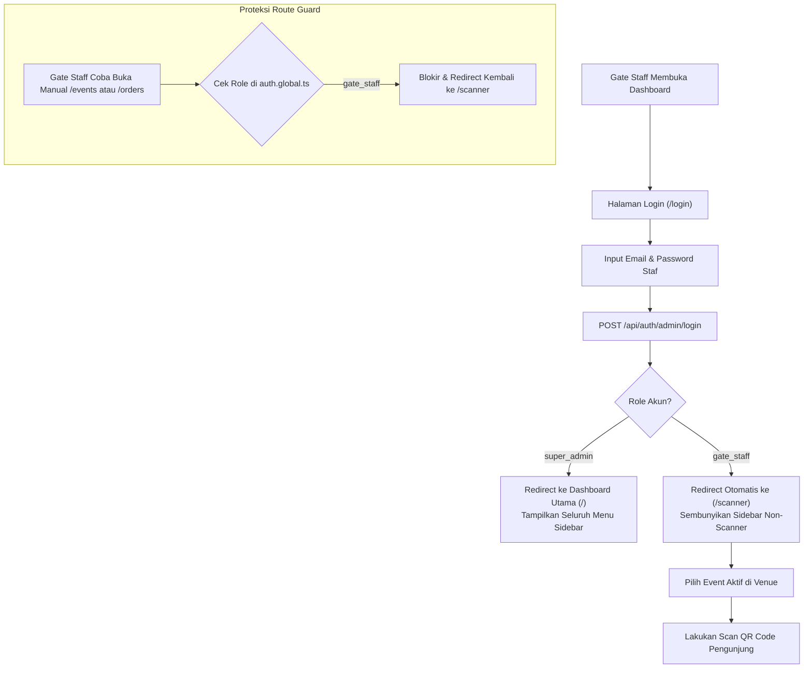
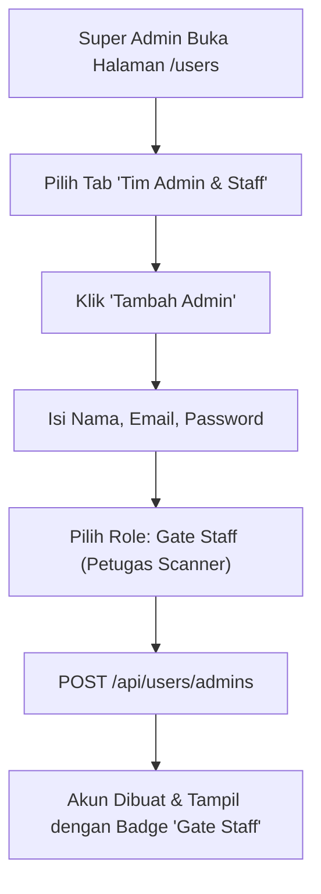

**PRD - GG Tix - Modul Autentikasi & Manajemen Akses**  
**GGT-08 - Role-Based Access Control & Gate Staff Operational Management**

| MODUL | PERSONA | PLATFORM | PRIORITAS | STATUS |
| --- | --- | --- | --- | --- |
| **Authentication & Access Management (RBAC)** | **Super Admin (Core Team), Gate Staff (Venue Crew), Customer** | **REST API (Hono + Bun) + Nuxt 4 Admin Dashboard** | **Phase 3 — High** | **Approved** |

**DACI Framework**

| **Driver** | Engineering Team |
| --- | --- |
| **Approver** | Product Owner & Security Lead |
| **Contributor** | Backend Developer, Frontend Developer, Event Operational Lead |
| **Informed** | Venue Operation Staff, QA Team, Marketing & Customer Service |

---

## Background Context

GG Tix beroperasi dengan model bisnis **Official Ticketing Platform** internal untuk konser musik gaming dan pop culture di Indonesia. Semua kurasi event, penentuan kategori tiket, kerja sama venue, verifikasi transaksi order, dan analisis finansial dikelola langsung secara tersentralisasi oleh Tim Inti GG Tix.

Dalam operasional di hari H konser (*concert day*), terdapat kebutuhan mendesak untuk mendelegasikan tugas validasi tiket dan pemindaian QR Code (*check-in*) kepada **Staf Lapangan (Gate Staff)** yang bertugas di pintu masuk gedung/venue. Staf lapangan ini membutuhkan antarmuka yang cepat, sederhana, dan fokus tanpa distraksi, serta **dilarang keras memiliki akses** ke konfigurasi master data (Event, Venue, Artis), data finansial (Revenue, Analytics), verifikasi order manual, maupun pengelolaan akun administrator.

Dokumen PRD ini menetapkan spesifikasi arsitektur **3-Tier RBAC** yang disempurnakan (`super_admin`, `gate_staff`, dan `customer`) agar aman, efisien, dan selaras dengan kebutuhan operasional nyata di lapangan.

---

## Problem Definition

**Apa problem / job yang dituju?**  
Belum adanya pemisahan peran operasional yang tegas dan aman antara Tim Inti Pengelola Platform (`super_admin`) dan Staf Pemeriksa Tiket di Lapangan (`gate_staff`), sehingga menimbulkan risiko keamanan data (potensi manipulasi master event / kebocoran data revenue) serta beban antarmuka yang membingungkan bagi staf lapangan di venue.

**Siapa yang menghadapi problem ini & seberapa penting?**  
- **Super Admin (Core Team)**: Perlu mendelegasikan tugas scan tiket kepada staf relawan/lapangan tanpa rasa khawatir akun mereka dapat mengubah data konser atau melihat laporan omzet. (**Kritis**)
- **Gate Staff (Venue Crew)**: Membutuhkan akses instan langsung ke kamera scanner QR (`/scanner`) tanpa menu administrasi lain yang tidak relevan. (**Tinggi**)
- **Customer / Penonton**: Membutuhkan kepastian bahwa proses check-in di gate venue berjalan cepat, aman, dan tidak terganggu antrean panjang akibat sistem yang lambat/rumit. (**Kritis**)

**Bagaimana mereka menyelesaikannya hari ini?**  
Sebelumnya role internal masih berstatus umum (`super_admin` vs `staff`), di mana staf masih memiliki akses parsial ke menu umum atau berpotensi membuka route administrasi yang tidak sesuai fungsinya.

**Jobs To Be Done**  
• *"Sebagai Super Admin, saya ingin membuat akun khusus Gate Staff yang hanya berhak membuka scanner dan membaca event untuk check-in, agar data event dan laporan omzet tetap aman."*  
• *"Sebagai Gate Staff, saya ingin saat login langsung otomatis diarahkan ke halaman Scanner QR dan tidak diganggu oleh menu-menu lain, agar proses pemeriksaan penonton di gate cepat dan fokus."*  
• *"Sebagai Petugas Keamanan Sistem, saya ingin backend secara ketat memblokir request API mutasi data jika request tersebut dikirim oleh Gate Staff."*

---

## Scope of Work

• **RBAC-01 (Database Schema & Enum Standardization)**: Pembaruan enum PostgreSQL `admin_role` menjadi `["super_admin", "gate_staff"]` dan migrasi akun tim internal.  
• **RBAC-02 (Backend API Route Gatekeeping)**: Penerapan middleware authorization yang secara tegas mengunci endpoint mutasi (CRUD Event, Category, Venue, Artist, Upload, Orders Verify, Users) hanya untuk `super_admin`, serta mengizinkan `gate_staff` hanya untuk:
  - `GET /api/events` (read-only list event untuk dropdown aktif di scanner)
  - `POST /api/tickets/check-in` (validasi & mutasi status check-in tiket)
  - `GET /api/tickets/stats/:eventId` (pantau kuota & occupancy check-in gate)
• **RBAC-03 (Frontend UX & Route Redirection)**: Implementasi route guard (`auth.global.ts`) dan filtering navigasi layout (`default.vue`):
  - Auto-redirect akun `gate_staff` ke `/scanner` setelah login.
  - Sembunyikan sidebar navigasi (Dashboard, Events, Venues, Artists, Orders, Users) bagi `gate_staff`.
  - Blokir akses manual via URL ke rute terlarang dengan redirect kembali ke `/scanner`.
• **RBAC-04 (User Management & Role Assignment)**: Pembaruan form modal tambah/edit admin di `/users` dengan pilihan role yang jelas (`Super Admin` vs `Gate Staff`).

---

## Out of Scope

• Sistem izin granular berbasis permission builder per-user (cukup menggunakan 3 role standar sistem).  
• Sistem multi-tenant promotor pihak ketiga (ekosistem tetap internal ticketing platform).

---

## Matriks Hak Akses & Permission (RBAC Matrix)

| Modul / Fitur | Endpoint Backend | Super Admin | Gate Staff | Customer |
| :--- | :--- | :---: | :---: | :---: |
| **Login Tim Internal** | `POST /api/auth/admin/login` | ✅ | ✅ | ❌ |
| **Login / Register Customer** | `POST /api/auth/customer/*` | ❌ | ❌ | ✅ |
| **Dashboard Analytics & KPI** | `GET /api/dashboard/summary` | ✅ | ❌ (403) | ❌ |
| **CRUD Event & Status Toggle** | `POST/PUT/PATCH/DELETE /api/events/*` | ✅ | ❌ (403) | ❌ |
| **Read Event List (Dropdown)** | `GET /api/events` | ✅ | ✅ | ✅ |
| **CRUD Kategori & Benefits** | `POST/PUT/DELETE /api/categories/*` | ✅ | ❌ (403) | ❌ |
| **CRUD Master Venue** | `POST/PUT/DELETE /api/venues/*` | ✅ | ❌ (403) | ❌ |
| **CRUD Master Artis** | `POST/PUT/DELETE /api/artists/*` | ✅ | ❌ (403) | ❌ |
| **Upload Media (B2 Storage)** | `POST /api/uploads` | ✅ | ❌ (403) | ❌ |
| **List & Verifikasi Order** | `GET/PATCH /api/orders/*` | ✅ | ❌ (403) | ❌ |
| **Buat Pesanan & Bayar Midtrans**| `POST /api/orders`, `POST /api/payments/*` | ❌ | ❌ | ✅ |
| **Scan QR Check-In** | `POST /api/tickets/check-in` | ✅ | ✅ | ❌ |
| **Live Check-in Stats** | `GET /api/tickets/stats/:eventId` | ✅ | ✅ | ❌ |
| **Kelola Tim Admin / Staff** | `GET/POST/PUT/DELETE /api/users/admins/*` | ✅ | ❌ (403) | ❌ |
| **Lihat Data Customer** | `GET /api/users/customers` | ✅ | ❌ (403) | ❌ |

---

## User Flow

### 1. Flow Login & Navigasi Gate Staff



### 2. Flow Pengelolaan Akun Staf oleh Super Admin



---

## Spesifikasi Teknis & Field

### 1. Database Enum & Schema

```typescript
// backend/src/db/schema.ts
export const adminRoleEnum = pgEnum("admin_role", ["super_admin", "gate_staff"]);

export const admins = pgTable("admins", {
  id: uuid("id").defaultRandom().primaryKey(),
  name: varchar("name", { length: 100 }).notNull(),
  email: varchar("email", { length: 150 }).notNull().unique(),
  passwordHash: text("password_hash").notNull(),
  role: adminRoleEnum("role").notNull().default("gate_staff"),
  createdAt: timestamp("created_at").notNull().defaultNow(),
});
```

### 2. Middleware Authorization Rule

```typescript
// backend/src/lib/middleware.ts
export async function superAdminOnly(c: Context, next: Next) {
  const user = c.get("user");
  if (!user || user.role !== "admin" || user.adminRole !== "super_admin") {
    throw new AppError("Akses ditolak: Hanya Super Admin yang diizinkan mengakses fitur ini.", 403);
  }
  await next();
}
```

---

## User Stories & Acceptance Criteria

| User Story | Acceptance Criteria | Est Points | Notes |
| :--- | :--- | :---: | :--- |
| Sebagai **Super Admin**, saya ingin membuat akun `gate_staff` baru di menu `/users` agar staf gate dapat bertugas. | - Form modal menyediakan opsi role `Super Admin` dan `Gate Staff`.<br/>- Data tersimpan di database dengan enum `gate_staff`.<br/>- Tabel admin menampilkan badge visual pembeda role. | 3 | UI & Form Validation |
| Sebagai **Gate Staff**, saya ingin langsung masuk ke halaman `/scanner` setelah login. | - Login sukses dengan token ber-role `gate_staff` mengarahkan router ke `/scanner`.<br/>- Sidebar navigasi hanya menampilkan menu Scanner dan Logout.<br/>- Dashboard KPI dan menu master data tidak dapat diakses. | 3 | Route Guard & Layout |
| Sebagai **Sistem Backend**, saya ingin memvalidasi hak akses setiap endpoint API. | - Request ke endpoint admin mutasi oleh token `gate_staff` menghasilkan error `403 Forbidden`.<br/>- Request ke `/api/tickets/check-in` berhasil diproses oleh `super_admin` maupun `gate_staff`. | 3 | API Middleware Hardening |

---

## Wording (Microcopy)

| Kondisi / Lokasi | Wording (Bahasa Indonesia) | Catatan |
| :--- | :--- | :--- |
| **Role Selector Modal** | `Super Admin (Akses Penuh Platform)` | Pilihan role owner/inti |
| **Role Selector Modal** | `Gate Staff (Petugas Scan Tiket Venue)` | Pilihan role operasional lapangan |
| **Badge Super Admin** | `Super Admin` (Warna Emerald / Purple) | Tampilan di tabel user |
| **Badge Gate Staff** | `Gate Staff` (Warna Cyan / Blue) | Tampilan di tabel user |
| **Pesan Akses Ditolak (403)** | `"Akses ditolak: Anda tidak memiliki wewenang untuk mengakses modul ini."` | Alert / Toast error |

---

> **Dokumen Terkait:**
> - [GG Tix - Dokumen Konsep Lengkap.md](file:///home/artdi/Projects/GG%20Tix/prd/GG%20Tix%20-%20Dokumen%20Konsep%20Lengkap.md)
> - [Backend API Contract - Panduan Integrasi Frontend.md](file:///home/artdi/Projects/GG%20Tix/prd/Backend%20API%20Contract%20-%20Panduan%20Integrasi%20Frontend.md)
> - [GGT-05: Digital Ticket Generation & QR Check-In System](file:///home/artdi/Projects/GG%20Tix/prd/GGT-05%20-%20Digital%20Ticket%20Generation%20%26%20QR%20Check-In%20System.md)
> - [GGT-07: Unified Middleware Architecture, RBAC & API Gatekeeping System](file:///home/artdi/Projects/GG%20Tix/prd/GGT-07%20-%20Unified%20Middleware%20Architecture,%20RBAC%20%26%20API%20Gatekeeping%20System.md)
