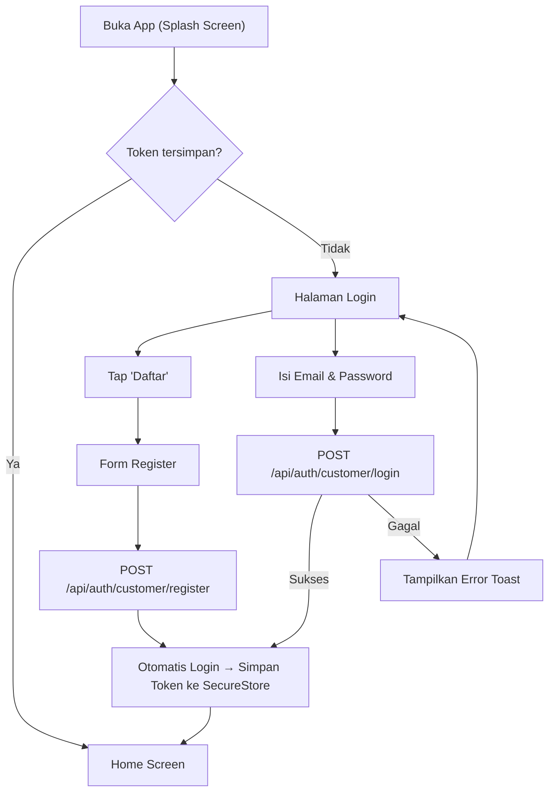
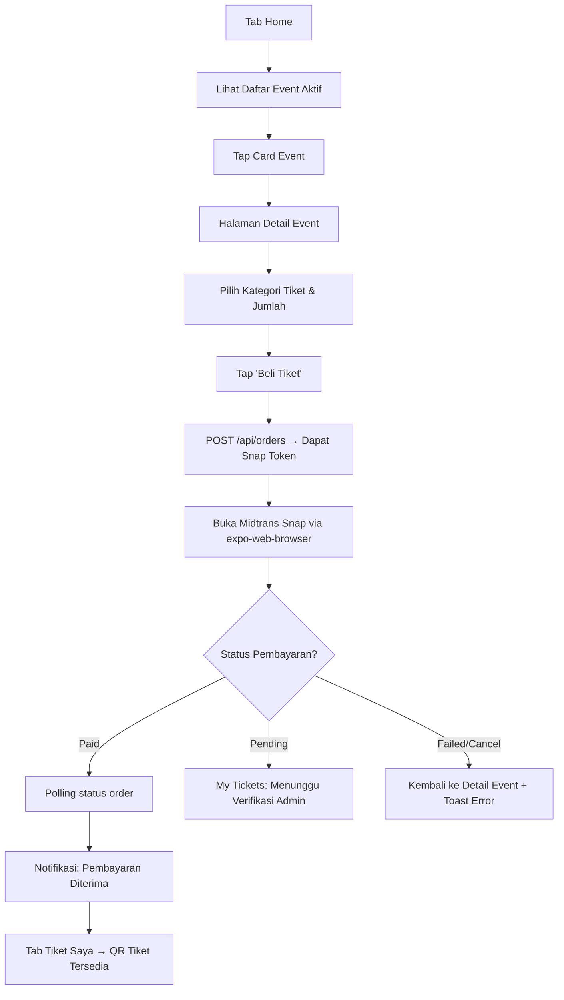
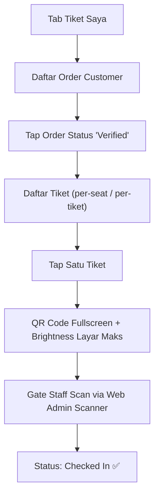

**PRD - GG Tix - Modul Mobile App Customer**  
**GGT-09 - Mobile App: Customer Ticketing Experience (React Native + Expo)**

| MODUL | PERSONA | PLATFORM | PRIORITAS | STATUS |
| --- | --- | --- | --- | --- |
| **Mobile App — Customer Facing** | **Customer (Gamer / Fan)** | **React Native — Expo SDK 57 (iOS + Android)** | **Phase 4 — High** | **Draft** |

**DACI Framework**

| **Driver** | Engineering Team (Mobile) |
| --- | --- |
| **Approver** | Product Owner |
| **Contributor** | Mobile Developer, Backend Developer, UI/UX Designer |
| **Informed** | Marketing Team, Customer Service, QA Team |

---

## Background Context

GG Tix adalah platform tiket konser gaming dan pop culture di Indonesia. Hingga PRD GGT-08, seluruh fungsionalitas customer (browse event, beli tiket, lihat e-ticket) hanya tersedia di web. Platform mobile (`mobile/`) sudah diinisialisasi menggunakan **React Native 0.86.2 + Expo SDK 57 + Expo Router**, namun saat ini hanya berisi scaffold bawaan — belum ada fitur produk sama sekali.

Dokumen ini menetapkan spesifikasi penuh **aplikasi mobile customer GG Tix**: dari autentikasi, browsing event, pembelian tiket via Midtrans, hingga tampilan e-ticket digital dengan QR Code yang dapat dipakai saat check-in di venue.

---

## Problem Definition

**Apa problem / job yang dituju?**  
Customer membutuhkan cara untuk membeli tiket konser gaming langsung dari smartphone mereka, tanpa harus membuka browser. Selain itu, tiket digital harus mudah diakses saat hari-H tanpa koneksi internet yang stabil.

**Siapa yang menghadapi problem ini & seberapa penting?**  
- **Customer (Gamer/Fan, 16–35 tahun)**: Mayoritas pengguna mengakses konten dari mobile. Tidak ada mobile app berarti potensi konversi hilang. (**Kritis**)  
- **Tim Operasional**: Gate Staff butuh QR yang bisa ditampilkan customer dari mobile, bukan hanya dari web. (**Tinggi**)

**Bagaimana mereka menyelesaikannya hari ini?**  
Customer menggunakan browser mobile untuk membuka dashboard web GG Tix. Pengalaman kurang optimal (responsif tapi tidak native), tidak ada push notification, dan akses e-ticket saat sinyal lemah menjadi masalah.

**Jobs To Be Done**  
• *"Sebagai Customer, saya ingin browse dan beli tiket konser dari smartphone saya, supaya prosesnya lebih cepat dan nyaman."*  
• *"Sebagai Customer, saya ingin melihat e-ticket dan QR Code saya langsung di aplikasi, supaya tidak perlu membuka laptop saat masuk venue."*  
• *"Sebagai Customer, saya ingin mendapat notifikasi saat event baru rilis atau pembayaran saya dikonfirmasi."*

---

## Scope of Work

- **MOB-01 (Autentikasi)**: Halaman Login dan Register Customer. Persistent session dengan JWT + Refresh Token disimpan di `expo-secure-store`.
- **MOB-02 (Home & Event Discovery)**: Tab utama berisi daftar event yang sedang buka (`status: open`), card event dengan cover image, tanggal, venue, dan nama artis.
- **MOB-03 (Detail Event & Kategori Tiket)**: Halaman detail event lengkap: deskripsi, lineup artis, seatmap, dan daftar kategori tiket beserta harga, kuota, dan benefit.
- **MOB-04 (Checkout & Pembayaran Midtrans)**: Form pemesanan (pilih kategori & jumlah tiket), konfirmasi order, lalu buka Midtrans Snap via `expo-web-browser`. Polling status pembayaran setelah kembali ke app.
- **MOB-05 (My Tickets / E-Ticket)**: Tab "Tiket Saya" yang menampilkan daftar order. Tiket yang sudah `verified` menampilkan QR Code digital per-tiket yang bisa di-scan Gate Staff.
- **MOB-06 (Riwayat Order)**: Daftar semua order customer dengan status (`pending`, `verified`, `rejected`, `expired`) dan detail transaksi.
- **MOB-07 (Push Notification)**: Notifikasi push untuk: konfirmasi pembayaran diverifikasi, pengingat hari-H event (H-1), dan rilis event baru.
- **MOB-08 (Profil & Pengaturan)**: Halaman profil: nama, email, ganti password, dan logout.

---

## Out of Scope

- Scanner QR check-in (fitur khusus Gate Staff, hanya di web admin).
- Pembelian tiket secara offline / cash.
- Multi-bahasa (bahasa Indonesia saja untuk V1).
- Fitur sosial (komentar, forum, share ke media sosial dengan deep link).
- In-app browser penuh; Midtrans dibuka via `expo-web-browser` terbatas.

---

## Spesifikasi Field

### MOB-01: Form Login

| **Field** | **Tipe / Input** | **Aturan & Batasan** | **Wajib** | **Catatan** |
| --- | --- | --- | --- | --- |
| **Email** | TextInput (email keyboard) | Format email valid | Ya | `POST /api/auth/customer/login` |
| **Password** | TextInput (secureTextEntry) | Min 6 karakter | Ya | Toggle show/hide password |

### MOB-01: Form Register

| **Field** | **Tipe / Input** | **Aturan & Batasan** | **Wajib** | **Catatan** |
| --- | --- | --- | --- | --- |
| **Nama Lengkap** | TextInput | Min 2, Max 100 karakter | Ya | |
| **Email** | TextInput (email keyboard) | Format email valid, unique | Ya | |
| **Password** | TextInput (secureTextEntry) | Min 6 karakter | Ya | |
| **Konfirmasi Password** | TextInput (secureTextEntry) | Harus sama dengan Password | Ya | Validasi sisi client saja |

### MOB-04: Form Checkout

| **Field** | **Tipe / Input** | **Aturan & Batasan** | **Wajib** | **Catatan** |
| --- | --- | --- | --- | --- |
| **Kategori Tiket** | Picker / Radio Button | Dari daftar kategori event aktif | Ya | `GET /api/events/:id/categories` |
| **Jumlah Tiket** | Stepper (min 1) | 1 s/d `maxTicketsPerOrder` event | Ya | Default 1 |

---

## State Layar Utama

| **Komponen / State** | **Kondisi / Data** | **Perilaku** | **Aksi** | **Referensi** |
| --- | --- | --- | --- | --- |
| **Home — Loading** | Data belum datang | Skeleton card animasi | — | Reanimated skeleton |
| **Home — Event List** | Ada event `status: open` | Daftar card event dengan cover | Tap → Detail Event | `GET /api/events?status=open` |
| **Home — Empty** | Tidak ada event aktif | Ilustrasi kosong + teks | — | |
| **Detail Event** | Data event lengkap | Cover, artis, deskripsi, seatmap, kategori | Tap "Beli Tiket" → Checkout | `GET /api/events/:id` |
| **Checkout — Konfirmasi** | Kategori & qty dipilih | Ringkasan order + total harga | Submit → Midtrans | `POST /api/orders` |
| **Midtrans WebView** | Snap Token tersedia | Browser in-app terbuka | Selesai bayar → polling status | `expo-web-browser` |
| **My Tickets — Verified** | Order status `verified` | Daftar tiket + QR Code | Tap tiket → QR fullscreen | `GET /api/tickets/order/:orderId` |
| **My Tickets — Pending** | Order status `pending` | Badge "Menunggu Verifikasi" | — | |
| **Profil** | User terautentikasi | Nama, email, tombol logout | Logout → Hapus token | |

---

## Forecasted Impact Metrics

- Konversi pembelian tiket dari mobile meningkat **≥ 40%** dalam 3 bulan pertama setelah launch.
- Rating aplikasi di App Store & Play Store rata-rata **≥ 4.3 bintang** dalam 60 hari.
- Waktu rata-rata dari buka app → selesai checkout **≤ 3 menit**.
- Tingkat keberhasilan scan QR dari tampilan mobile **≥ 99%** (brightness & ukuran QR code optimal).

---

## User Flow

**Alur 1: Register & Login.** Langkah ringkas: (1) Buka app → splash screen → cek token. (2) Jika belum login → halaman Login. (3) Tap "Daftar" → isi form Register → submit → otomatis login → masuk Home. (4) Atau isi email & password → Login → masuk Home.

**Alur 2: Browse Event & Beli Tiket.** Langkah ringkas: (1) Tab Home → daftar event aktif. (2) Tap event → halaman detail event & kategori tiket. (3) Pilih kategori + jumlah → tap "Beli Tiket" → konfirmasi order. (4) Buka Midtrans Snap → selesai bayar → kembali ke app → status order diperbarui.

**Alur 3: Lihat E-Ticket & Check-In di Venue.** Langkah ringkas: (1) Tab "Tiket Saya" → pilih order verified. (2) Tap tiket → QR Code fullscreen. (3) Naikkan brightness → tunjukkan ke Gate Staff untuk di-scan. (4) Status tiket berubah "Checked In".

---

## Design

Figma: [Link prototype — diisi saat UX sign-off]. Mencakup: Splash Screen, Onboarding, Login, Register, Home (Event List), Detail Event, Checkout Konfirmasi, Midtrans WebView, My Tickets, E-Ticket QR Fullscreen, Order History, Profil & Pengaturan.

**Panduan Visual:**
- Palet utama: `#1B1330` (dark indigo) + `#F2A93B` (amber accent) — sesuai brand GG Tix web.
- Tipografi: sistem font native (SF Pro di iOS, Roboto di Android) via `Fonts` di `theme.ts`.
- Dark mode: didukung secara otomatis via `useColorScheme()` yang sudah ada di codebase.
- Tab bar: 4 tab — **Beranda**, **Tiket Saya**, **Riwayat**, **Profil**.

---

## User Stories & Acceptance Criteria

| **User Story** | **Acceptance Criteria** | **Est Points** | **Notes** |
| --- | --- | --- | --- |
| Sebagai **Customer**, saya ingin mendaftar & login agar bisa menggunakan fitur pembelian tiket. | - Form register & login tersedia. - Token JWT disimpan di `expo-secure-store`. - Session persistent saat app ditutup & dibuka kembali. - Error ditampilkan via toast saat kredensial salah. | 5 | MOB-01 |
| Sebagai **Customer**, saya ingin melihat daftar event aktif agar bisa memilih konser yang ingin saya tonton. | - Home menampilkan event dengan `status: open`. - Card menampilkan cover image, judul, tanggal, dan kota. - Skeleton loading tampil saat fetch. - Empty state tampil jika tidak ada event. | 5 | MOB-02 |
| Sebagai **Customer**, saya ingin melihat detail event & memilih kategori tiket agar bisa memutuskan pembelian. | - Halaman detail menampilkan deskripsi, artis, venue, seatmap (jika ada), dan daftar kategori tiket dengan harga & benefit. - Kategori dengan `quotaSold >= quotaTotal` ditampilkan sebagai "Habis Terjual". | 5 | MOB-03 |
| Sebagai **Customer**, saya ingin menyelesaikan pembayaran via Midtrans agar tiket saya segera diproses. | - Snap Token diterima dari backend setelah `POST /api/orders`. - Midtrans Snap terbuka via `expo-web-browser`. - Setelah browser ditutup, app melakukan polling status order. - Order `verified` muncul di tab Tiket Saya. | 8 | MOB-04 |
| Sebagai **Customer**, saya ingin melihat QR Code tiket saya di aplikasi agar bisa check-in di venue dengan mudah. | - Tab Tiket Saya menampilkan semua order. - Order `verified` menampilkan daftar tiket individual. - Tap tiket menampilkan QR Code fullscreen dengan brightness layar dinaikkan otomatis. - QR Code dapat di-scan oleh scanner Gate Staff. | 5 | MOB-05 |
| Sebagai **Customer**, saya ingin mendapat push notification agar tidak ketinggalan info penting terkait tiket saya. | - Notifikasi terkirim saat pembayaran diverifikasi admin. - Notifikasi pengingat event dikirim H-1 hari event. - User dapat menonaktifkan notifikasi dari pengaturan OS. | 5 | MOB-07 |

---

## Wording (Microcopy)

| **Kondisi / Field** | **Wording (Bahasa Indonesia)** | **Catatan** |
| --- | --- | --- |
| **Login — Judul** | `"Masuk ke GG Tix"` | |
| **Login — Tombol** | `"Masuk"` | |
| **Register — Judul** | `"Buat Akun GG Tix"` | |
| **Register — Tombol** | `"Daftar Sekarang"` | |
| **Login — Link Register** | `"Belum punya akun? Daftar"` | |
| **Home — Empty State** | `"Belum ada event yang tersedia saat ini. Pantau terus ya!"` | |
| **Kategori Habis** | `"Habis Terjual"` | Badge merah/abu pada kategori kuota penuh |
| **Tombol Beli Tiket** | `"Beli Tiket"` | Di halaman detail event |
| **Checkout — Judul** | `"Konfirmasi Pesanan"` | |
| **Checkout — Tombol** | `"Lanjut ke Pembayaran"` | |
| **Status Tiket Pending** | `"Menunggu Verifikasi Admin"` | Badge kuning |
| **Status Tiket Verified** | `"Tiket Aktif ✓"` | Badge hijau |
| **Status Tiket Rejected** | `"Pembayaran Ditolak"` | Badge merah |
| **Status Tiket Expired** | `"Kadaluwarsa"` | Badge abu |
| **QR Screen — Judul** | `"Tunjukkan QR ini ke petugas gate"` | Teks kecil di atas QR |
| **Logout — Konfirmasi** | `"Yakin ingin keluar dari akun ini?"` | Alert dengan tombol "Keluar" & "Batal" |
| **Error Umum** | `"Terjadi kesalahan. Silakan coba lagi."` | Toast error fallback |
| **Push Notif — Verifikasi** | `"Pembayaran kamu untuk [Event] telah dikonfirmasi! Tiketmu sudah siap."` | |
| **Push Notif — H-1** | `"Event [Judul Event] besok! Jangan lupa bawa tiket digitalmu."` | |

---

## Tech Stack & Dependencies

| **Kebutuhan** | **Library** | **Catatan** |
| --- | --- | --- |
| Framework | React Native 0.86.2 + Expo SDK 57 | Sudah tersedia di codebase |
| Routing | Expo Router ~57 + NativeTabs | Sudah tersedia |
| HTTP Client | `fetch` native / `axios` | |
| Secure Storage | `expo-secure-store` | Simpan JWT & Refresh Token |
| QR Code Display | `react-native-qrcode-svg` | Render QR Code dari string tiket |
| Push Notification | `expo-notifications` + FCM | Backend sudah menyebut FCM di arsitektur |
| Payment | `expo-web-browser` | Buka Midtrans Snap URL — sudah terinstall |
| State Management | Zustand atau React Context | Pilih satu, konsisten di seluruh app |
| Image | `expo-image` ~57 | Sudah tersedia |
| Animasi | `react-native-reanimated` 4.5.1 | Sudah tersedia |
| Gesture | `react-native-gesture-handler` ~2.32 | Sudah tersedia |

---

> **Dokumen Terkait:**
> - [GG Tix — Dokumen Konsep Lengkap](./GG%20Tix%20-%20Dokumen%20Konsep%20Lengkap.md)
> - [Backend API Contract — Panduan Integrasi Frontend](./Backend%20API%20Contract%20-%20Panduan%20Integrasi%20Frontend.md)
> - [GGT-05: Digital Ticket Generation & QR Check-In System](./GGT-05%20-%20Digital%20Ticket%20Generation%20%26%20QR%20Check-In%20System.md)
> - [GGT-06: Midtrans Payment Gateway Integration](./GGT-06%20-%20Midtrans%20Payment%20Gateway%20Integration.md)
> - [GGT-08: Role-Based Access Control & Gate Staff Operational Management](./GGT-08%20-%20Role-Based%20Access%20Control%20%26%20Gate%20Staff%20Operational%20Management.md)

*Dokumen ini mengacu pada codebase `mobile/` yang sudah diinisialisasi dengan Expo SDK 57, Expo Router, NativeTabs, Reanimated 4.x, dan Gesture Handler. Semua fitur di PRD ini dibangun di atas scaffold tersebut. Lengkapi dengan Figma prototype sebelum kickoff development sprint.*
