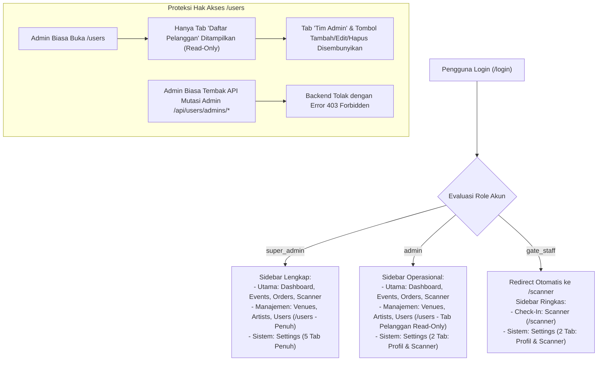
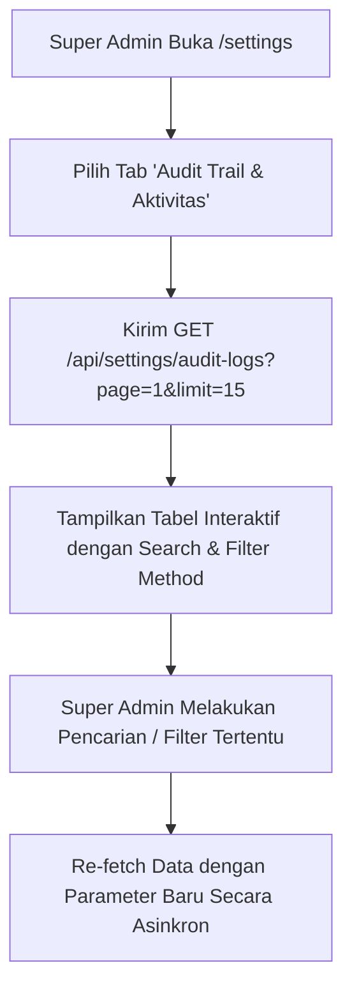
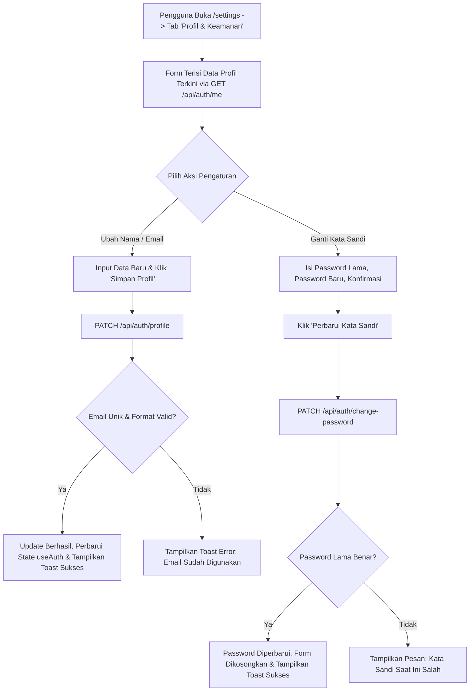

**PRD - GG Tix - Modul Pengaturan Sistem, RBAC 4-Tier & Audit Trail**  
**GGT-10 - System Settings, Profile Management, 4-Tier RBAC & Audit Trail System**

| MODUL | PERSONA | PLATFORM | PRIORITAS | STATUS |
| :--- | :--- | :--- | :--- | :--- |
| **System Settings, RBAC & Audit Trail** | **Super Admin (Master Owner), Admin (Operational), Gate Staff (Venue Crew), Customer** | **REST API (Hono + Bun + PostgreSQL) + Nuxt 4 Admin Console** | **Phase 3 — High** | **Approved** |

**DACI Framework**

| **Driver** | Engineering Team (Frontend & Backend Lead) |
| :--- | :--- |
| **Approver** | Product Owner & Security Lead |
| **Contributor** | Backend Developer, Frontend Developer, Security Engineer, Event Operations Lead |
| **Informed** | Tim Admin & Customer Support, Venue Field Crew, QA Team |

---

## Background Context

GG Tix beroperasi sebagai **Official Ticketing Platform** internal untuk konser musik gaming dan pop culture di Indonesia. Pada dashboard admin GG Tix (berbasis Nuxt 4 + Nuxt UI), navigasi menu utama di sidebar (`/settings`) pada grup *Sistem* dan menu dropdown avatar akun di topbar (*"Pengaturan Akun"*) mengarah ke `/settings`, namun halaman tersebut saat ini masih kosong (*blank page*).

Selain kebutuhan antarmuka pengaturan mandiri, hasil evaluasi tata kelola operasional dan keamanan sistem menunjukkan tiga kebutuhan arsitektural mendesak:

1. **Kebutuhan Standarisasi 4-Tier RBAC**:
   Sebelumnya, platform mengelompokkan tim internal hanya dalam 2 peran (`super_admin` dan `gate_staff`). Dalam struktur organisasi nyata, tidak boleh ada banyak akun yang memiliki status `super_admin` karena berisiko tinggi terhadap keamanan master user dan konfigurasi sistem. Diperlukan role perantara, yaitu **`admin` (Operational Admin)**, yang bertugas mengelola event, venue, artis, dan verifikasi order harian, serta memiliki akses **Read-Only ke data Pelanggan/Customer** (`/users`) untuk keperluan pemantauan dan investigasi akun pengguna yang bermasalah, namun **dilarang keras** memodifikasi akun tim admin, melihat audit trail, atau mengubah parameter konfigurasi sistem.
2. **Ketiadaan Audit Trail Persisten di Database**:
   Aktivitas administratif krusial (seperti perubahan data konser, penambahan kuota, verifikasi/penolakan order transaksi, dan perubahan konfigurasi sistem) saat ini hanya tercatat di in-memory buffer dan log console terminal. Jika server restart, data log hilang. Dibutuhkan tabel PostgreSQL `audit_logs` persisten serta antarmuka visual terpusat bagi `super_admin` untuk melacak siapa yang melakukan aksi apa, kapan, dari IP mana, dan status eksekusinya.
3. **Ketiadaan Pengaturan Mandiri & Preferensi Operasional**:
   Pengguna internal (baik Super Admin, Admin operasional, maupun Gate Staff) belum memiliki antarmuka untuk memperbarui profil dan mengganti password mandiri, mengonfigurasi batas waktu kedaluwarsa pesanan pending, kontak support, serta pengaturan audio dan kamera untuk pemindaian tiket di gate venue.

Dokumen PRD **GGT-10** ini menetapkan standarisasi menyeluruh untuk **Fitur Settings (/settings)**, **Hierarki 4-Tier RBAC**, serta **Sistem Audit Trail Terintegrasi**.

---

## Problem Definition

**Apa problem / job yang dituju?**  
1. Halaman `/settings` masih kosong tanpa antarmuka profil mandiri, pengaturan scanner, dan konfigurasi sistem.
2. Belum ada pemisahan peran antara `super_admin` (pemegang hak mutlak user & konfigurasi) dan `admin` operasional (pengelola konten, transaksi, dan customer read-only).
3. Log audit aktivitas belum tersimpan secara persisten di database dan belum bisa dipantau secara visual oleh Super Admin.

**Siapa yang menghadapi problem ini & seberapa penting?**  
- **Super Admin (Master Owner)**: Perlu mendelegasikan operasional harian ke tim Admin tanpa memberikan akses ke modul pembuatan/mutasi admin baru atau konfigurasi sensitif. (**Kritis**)
- **Admin Operasional**: Membutuhkan hak akses penuh ke Event, Venue, Artis, Order, serta pemantauan data customer (read-only) untuk investigasi akun bermasalah tanpa dibebani akses sensitif ke data kredensial tim. (**Tinggi**)
- **Gate Staff (Venue Crew)**: Membutuhkan kemudahan mengganti password pribadi dan mengatur volume audio beep scanner di perangkat venue. (**Tinggi**)
- **Auditor & Security Team**: Membutuhkan riwayat audit trail yang tidak dapat dimanipulasi untuk investigasi insiden. (**Kritis**)

**Bagaimana mereka menyelesaikannya hari ini?**  
Penggantian password dilakukan manual via database / bantuan Super Admin. Tidak ada pemisahan role operasional, dan log aksi hanya bisa dilihat secara manual melalui log server.

**Jobs To Be Done**  
• *"Sebagai Super Admin, saya ingin membuat akun 'Admin' biasa yang bisa mengelola event, order, dan melihat data customer secara read-only tanpa bisa memanipulasi akun admin lain, agar data akun tim dan konfigurasi sistem tetap terlindungi."*  
• *"Sebagai Admin Operasional, saya ingin melihat daftar customer (read-only) di menu /users untuk memeriksa identitas pelanggan yang komplain atau bermasalah saat transaksi tiket."*  
• *"Sebagai Super Admin, saya ingin melihat tabel Audit Trail lengkap di halaman /settings untuk mengetahui seluruh riwayat mutasi data yang dilakukan staf."*  
• *"Sebagai Pengguna Internal (Semua Role), saya ingin memperbarui nama saya dan mengganti kata sandi secara mandiri di tab Profil & Keamanan."*  
• *"Sebagai Gate Staff, saya ingin mengatur suara feedback pemindai QR dan mode continuous scan di tab Preferensi Scanner."*  
• *"Sebagai Super Admin, saya ingin mengatur batas waktu kedaluwarsa pesanan pending dan kontak resmi CS platform secara dinamis."*

---

## Matriks Hak Akses 4-Tier RBAC (RBAC Matrix)

Hierarki peran sistem GG Tix kini distandarisasi menjadi 4 tingkatan:

| Modul / Fitur / Endpoint | Endpoint Backend | Super Admin | Admin (Operasional) | Gate Staff | Customer |
| :--- | :--- | :---: | :---: | :---: | :---: |
| **Login Tim Internal** | `POST /api/auth/admin/login` | ✅ | ✅ | ✅ | ❌ |
| **Login / Register Customer** | `POST /api/auth/customer/*` | ❌ | ❌ | ❌ | ✅ |
| **Kelola Profil & Ganti Password Sendiri**| `PATCH /api/auth/profile`, `PATCH /api/auth/change-password` | ✅ | ✅ | ✅ | ✅ (`/me`) |
| **Dashboard Analytics & KPI** | `GET /api/dashboard/summary` | ✅ | ✅ | ❌ (403) | ❌ |
| **CRUD Event & Status Toggle** | `POST/PUT/PATCH/DELETE /api/events/*` | ✅ | ✅ | ❌ (403) | ❌ |
| **CRUD Kategori & Benefits** | `POST/PUT/DELETE /api/categories/*` | ✅ | ✅ | ❌ (403) | ❌ |
| **CRUD Master Venue** | `POST/PUT/DELETE /api/venues/*` | ✅ | ✅ | ❌ (403) | ❌ |
| **CRUD Master Artis** | `POST/PUT/DELETE /api/artists/*` | ✅ | ✅ | ❌ (403) | ❌ |
| **Upload Media (B2 Storage)** | `POST /api/uploads` | ✅ | ✅ | ❌ (403) | ❌ |
| **List & Verifikasi Order** | `GET/PATCH /api/orders/*` | ✅ | ✅ | ❌ (403) | ❌ |
| **Scan QR Check-In & Stats** | `POST /api/tickets/check-in`, `GET /api/tickets/stats/*` | ✅ | ✅ | ✅ | ❌ |
| **Lihat Data Pelanggan (Customer Read-Only)**| `GET /api/users/customers` | ✅ | ✅ (Read-Only) | ❌ (403) | ❌ |
| **Kelola Tim Admin / Staff (CRUD)**| `GET/POST/PUT/DELETE /api/users/admins/*` | ✅ | ❌ (403) | ❌ (403) | ❌ |
| **Konfigurasi Platform (`/settings`)** | `GET/PATCH /api/settings/system` | ✅ | ❌ (403) | ❌ (403) | ❌ |
| **Audit Trail & Activity Log** | `GET /api/settings/audit-logs` | ✅ | ❌ (403) | ❌ (403) | ❌ |
| **Diagnostik Status Sistem** | `GET /api/settings/diagnostics` | ✅ | ❌ (403) | ❌ (403) | ❌ |

---

## Scope of Work

Dokumen PRD GGT-10 mencakup 5 komponen terintegrasi:

### 1. SET-01: Tab "Profil & Keamanan" (Semua Role Internal)
- Form edit profil pribadi: Nama lengkap dan alamat email.
- Form ganti kata sandi mandiri: Verifikasi *Password Lama* (`currentPassword`), *Password Baru* (min 6 karakter), dan *Konfirmasi Password Baru*.
- Kartu ringkasan identitas akun: Avatar, Nama, Email, Role badge (`Super Admin` / `Admin` / `Gate Staff`), ID Admin (UUID), dan tanggal pembuatan akun.

### 2. SET-02: Tab "Preferensi Scanner" (Semua Role Internal)
- Toggle Audio Feedback: Mengaktifkan/menonaktifkan efek suara verifikasi scan QR.
- Slider Pengatur Volume Audio: 0% s/d 100% (default: 80%).
- Tombol *"Uji Coba Suara (Test Beep)"*: Memainkan audio preview verifikasi langsung di browser.
- Toggle *Continuous Scanning*: Scanner otomatis bersiap membaca tiket berikutnya dalam jeda 2 detik tanpa perlu klik tombol ulang.
- Selector Orientasi Kamera: Pilihan kamera belakang (*environment*) atau kamera depan (*user*).
- Seluruh preferensi scanner disimpan pada `localStorage` browser perangkat venue.

### 3. SET-03: Tab "Konfigurasi Platform" (Khusus Super Admin)
- Form pengaturan parameter operasional global GG Tix:
  - `defaultMaxTicketsPerOrder`: Batas standar tiket per transaksi jika tidak di-override di level event (1-10 tiket, default: 4).
  - `pendingOrderExpiryMinutes`: Batas waktu pembayaran pesanan sebelum kuota di-refund otomatis (5-120 menit, default: 15 menit).
  - `supportEmail`: Email customer support resmi (contoh: `support@ggtix.id`).
  - `supportWhatsapp`: Nomor WhatsApp Helpdesk darurat penonton di venue.
  - `maintenanceMode`: Toggle aktivasi mode pemeliharaan sistem.

### 4. SET-04: Tab "Audit Trail & Aktivitas" (Khusus Super Admin)
- Tabel log aktivitas riwayat mutasi sistem yang tersimpan di PostgreSQL:
  - Kolom: Waktu (*timestamp*), Admin/User ID, Role, Metode HTTP (`POST`, `PUT`, `PATCH`, `DELETE`), Endpoint/Resource, Status HTTP (200, 400, 403, 500), Alamat IP, dan Durasi Eksekusi (ms).
  - Fitur Pencarian & Filter: Search by keyword/path, filter by Method, filter by Status Code, dan filter rentang tanggal.
  - Paginasi data server-side (default 15 baris per halaman).

### 5. SET-05: Tab "Status Sistem & Diagnostik" (Khusus Super Admin)
- Monitoring status layanan terhubung:
  - **Database PostgreSQL**: Status konektivitas dan latensi ping query (ms).
  - **Backblaze B2 Object Storage**: Status kesiapan bucket penyimpanan aset gambar.
  - **Midtrans Payment Gateway**: Status koneksi API sandbox/production.
  - **Runtime & Build Info**: Versi Nuxt UI / Vue, Versi Backend Hono/Bun, Uptime server, dan active environment.

### 6. SET-06: Database Schema & API Middleware Update
- Pembaruan enum `admin_role` di database menjadi `['super_admin', 'admin', 'gate_staff']`.
- Pembuatan tabel baru `audit_logs` di database PostgreSQL.
- Penyempurnaan middleware `auditTrailMiddleware` untuk menyimpan data log secara asinkron ke tabel `audit_logs`.
- Implementasi endpoint API:
  - `PATCH /api/auth/profile`
  - `PATCH /api/auth/change-password`
  - `GET /api/settings/system` & `PATCH /api/settings/system`
  - `GET /api/settings/audit-logs`
  - `GET /api/settings/diagnostics`

---

## Out of Scope

• Autentikasi 2-Faktor berbasis Authenticator App (TOTP) / SMS OTP (masuk roadmap Phase 5).  
• Ekspor audit log ke format CSV/Excel (cukup pagination visual dan query JSON di tahap ini).  
• Fitur hard-delete log audit (audit log bersifat append-only demi integritas audit trail).

---

## Spesifikasi Teknis & Database Schema

### 1. Database Enum & Schema (`backend/src/db/schema.ts`)

```typescript
// 1. Standarisasi Enum Admin Role (4-Tier)
export const adminRoleEnum = pgEnum("admin_role", [
  "super_admin",
  "admin",
  "gate_staff",
]);

// 2. Tabel Admins
export const admins = pgTable("admins", {
  id: uuid("id").defaultRandom().primaryKey(),
  name: varchar("name", { length: 100 }).notNull(),
  email: varchar("email", { length: 150 }).notNull().unique(),
  passwordHash: text("password_hash").notNull(),
  role: adminRoleEnum("role").notNull().default("admin"),
  createdAt: timestamp("created_at").notNull().defaultNow(),
});

// 3. Tabel Persisten Audit Logs
export const auditLogs = pgTable(
  "audit_logs",
  {
    id: uuid("id").defaultRandom().primaryKey(),
    requestId: varchar("request_id", { length: 128 }),
    userId: uuid("user_id").references(() => admins.id, { onDelete: "set null" }),
    userEmail: varchar("user_email", { length: 150 }),
    userRole: varchar("user_role", { length: 50 }),
    method: varchar("method", { length: 10 }).notNull(),
    path: text("path").notNull(),
    statusCode: integer("status_code").notNull(),
    ip: varchar("ip", { length: 50 }).notNull(),
    userAgent: text("user_agent"),
    durationMs: integer("duration_ms"),
    details: jsonb("details"),
    createdAt: timestamp("created_at", { withTimezone: true }).notNull().defaultNow(),
  },
  (table) => ({
    userIdIdx: index("audit_logs_user_id_idx").on(table.userId),
    createdAtIdx: index("audit_logs_created_at_idx").on(table.createdAt),
    pathIdx: index("audit_logs_path_idx").on(table.path),
    statusIdx: index("audit_logs_status_idx").on(table.statusCode),
  })
);
```

### 2. Spesifikasi Endpoint API Baru

| Method | Path | Auth / Role | Deskripsi |
| :--- | :--- | :--- | :--- |
| `PATCH` | `/api/auth/profile` | Logged In (`admin`, `super_admin`, `gate_staff`) | Update nama & email pengguna saat ini |
| `PATCH` | `/api/auth/change-password` | Logged In (`admin`, `super_admin`, `gate_staff`) | Ganti password mandiri dengan verifikasi `currentPassword` |
| `GET` | `/api/settings/system` | Super Admin Only | Membaca konfigurasi parameter platform |
| `PATCH` | `/api/settings/system` | Super Admin Only | Memperbarui parameter bisnis & kontak support platform |
| `GET` | `/api/settings/audit-logs` | Super Admin Only | Mengambil list audit logs berpaginasi dengan filter |
| `GET` | `/api/settings/diagnostics` | Super Admin Only | Memeriksa status kesehatan koneksi DB, B2, dan Midtrans |

---

## Spesifikasi Field

### 1. Form Profil Pribadi (`PATCH /api/auth/profile`)

| **Field** | **Tipe / Input** | **Aturan & Batasan** | **Wajib** | **Catatan** |
| :--- | :--- | :--- | :---: | :--- |
| **name** | Text Input | Minimal 2 karakter, maksimal 100 karakter. | Ya | Nama tampilan pengguna |
| **email** | Email Input | Format email valid, unik di tabel `admins`. | Ya | Email login pengguna |

### 2. Form Ganti Password Mandiri (`PATCH /api/auth/change-password`)

| **Field** | **Tipe / Input** | **Aturan & Batasan** | **Wajib** | **Catatan** |
| :--- | :--- | :--- | :---: | :--- |
| **currentPassword** | Password Input | Wajib diisi, diverifikasi terhadap hash database. | Ya | Verifikasi otentisitas |
| **newPassword** | Password Input | Minimal 6 karakter, kombinasi huruf & angka. | Ya | Password baru |
| **confirmNewPassword** | Password Input | Wajib sama persis dengan `newPassword`. | Ya | Konfirmasi cegah typo |

### 3. Form Konfigurasi Platform (`PATCH /api/settings/system`)

| **Field** | **Tipe / Input** | **Aturan & Batasan** | **Wajib** | **Catatan** |
| :--- | :--- | :--- | :---: | :--- |
| **defaultMaxTicketsPerOrder** | Number Input | Angka 1 s/d 10. Default: 4. | Ya | Batas default beli tiket |
| **pendingOrderExpiryMinutes** | Number Input | Angka 5 s/d 120 menit. Default: 15. | Ya | Timeout pembayaran pending |
| **supportEmail** | Email Input | Format email valid. | Ya | Ditampilkan di e-ticket |
| **supportWhatsapp** | Text Input | Format nomor telepon internasional (+62...). | Ya | Helpdesk darurat venue |
| **maintenanceMode** | Switch / Toggle | Boolean (`true` / `false`). Default: `false`. | Ya | Mode pemeliharaan sistem |

### 4. Form Preferensi Scanner (Client-Side Storage / `localStorage`)

| **Field** | **Tipe / Input** | **Aturan & Batasan** | **Wajib** | **Catatan** |
| :--- | :--- | :--- | :---: | :--- |
| **scannerSoundEnabled** | Switch / Toggle | Boolean (`true` / `false`). Default: `true`. | Ya | Suara beep verifikasi |
| **scannerSoundVolume** | Slider (0-100) | Angka persentase 0% - 100%. Default: 80%. | Tidak | Volume nada verifikasi |
| **scannerContinuousMode** | Switch / Toggle | Boolean (`true` / `false`). Default: `true`. | Ya | Auto-scan berikutnya tanpa tap |
| **scannerCameraFacing** | Select Dropdown | `environment` (Belakang) atau `user` (Depan). | Ya | Orientasi lensa pemindai |

---

## State Halaman Settings (Sesuai Nuxt UI)

| **Komponen / State** | **Kondisi / Data** | **Perilaku** | **Aksi** | **Referensi** |
| :--- | :--- | :--- | :--- | :--- |
| **Role-Based Tab Visibility** | Login sebagai `gate_staff` / `admin` | Hanya menampilkan 2 Tab (*"Profil & Keamanan"* dan *"Preferensi Scanner"*). Tab Konfigurasi, Audit Trail, dan Diagnostik disembunyikan. | Auto-filter tab list | Nuxt UI `UTabs` |
| **Role-Based Tab Visibility** | Login sebagai `super_admin` | Menampilkan seluruh 5 Tab (*"Profil & Keamanan"*, *"Preferensi Scanner"*, *"Konfigurasi Platform"*, *"Audit Trail"*, *"Status Sistem"*). | Akses penuh | Nuxt UI `UTabs` |
| **Audit Logs Table** | Tab *"Audit Trail"* dibuka | Fetch data dari `GET /api/settings/audit-logs` dengan skeleton loader dan paginasi server-side. | Query audit trail | `UTable` & `UPagination` |
| **Audit Log Status Badge** | Status HTTP Response | Status `2xx`: Badge Hijau (Success); `4xx`: Badge Kuning (Warning/Client Error); `5xx`: Badge Merah (Server Error). | Visual badge indicator | `UBadge` |
| **Form Profile Loading** | Saat tombol *"Simpan Profil"* diklik | Tombol berubah menjadi loading state (`loading=true`), form input di-disable sementara. | Kirim `PATCH /api/auth/profile` | Nuxt UI `UButton` |
| **Form Password Error** | `currentPassword` salah atau konfirmasi password tidak cocok | Tampilkan pesan error pada field terkait dan toast notification merah. | Focus ke input error | Toast `color="error"` |
| **Save Confirmation Toast** | Data pengaturan berhasil disimpan | Tampilkan toast feedback sukses warna emerald: *"Pengaturan berhasil diperbarui."* | Auto-dismiss 3 detik | Toast `color="success"` |

---

## Forecasted Impact Metrics

• **100% Zero 404 Route**: Rute `/settings` berfungsi penuh tanpa error blank page bagi seluruh role pengguna internal.  
• **Pencegahan Akses Tak Sah (Zero Privilege Creep)**: 100% akun `admin` biasa dan `gate_staff` terblokir dari modifikasi user dan konfigurasi platform.  
• **100% Persistensi Audit Trail**: Setiap mutasi administratif tercatat ke PostgreSQL secara non-blocking dengan overhead latensi < 5ms.  
• **Kecepatan Resolusi Insiden**: Waktu pelacakan riwayat perubahan tiket/order berkurang dari jam ke hitungan detik melalui tab Audit Trail visual.

---

## User Flow

### 1. Flow RBAC Navigasi & Tampilan Sidebar



### 2. Flow Tab Settings & Audit Trail (Super Admin)



### 3. Flow Pembaruan Profil & Ganti Password Mandiri



---

## Design & UI Layout Structure (`/settings`)

```
+---------------------------------------------------------------------------------------------------------+
|  PENGATURAN SISTEM & PROFIL                                                                             |
|  Kelola akun pribadi, operasional pemindai tiket, konfigurasi bisnis, dan log aktivitas platform       |
+---------------------------------------------------------------------------------------------------------+
|  [ 👤 Profil & Keamanan ] [ 📷 Preferensi Scanner ] [ ⚙️ Konfigurasi ] [ 📜 Audit Trail ] [ 🩺 Status ] |
+---------------------------------------------------------------------------------------------------------+
|                                                                                                         |
|  (CONTOH TAB 4: AUDIT TRAIL & AKTIVITAS - KHUSUS SUPER ADMIN)                                           |
|                                                                                                         |
|  +---------------------------------------------------------------------------------------------------+  |
|  | [ Cari Path / Email / ID... ]  [ Filter Method: ALL v ]  [ Filter Status: ALL v ]  [ Refresh 🔄 ] |  |
|  +---------------------------------------------------------------------------------------------------+  |
|  | Waktu            | Admin / User           | Method | Resource Path            | Status  | IP         |  |
|  |------------------|------------------------|--------|--------------------------|---------|------------|  |
|  | 21/08/26 17:05   | budi@ggtix.com (Super) | POST   | /api/events              | 201 OK  | 127.0.0.1  |  |
|  | 21/08/26 16:42   | siti@ggtix.com (Staff) | POST   | /api/tickets/check-in    | 200 OK  | 10.0.4.12  |  |
|  | 21/08/26 15:30   | andi@ggtix.com (Admin) | PATCH  | /api/orders/ORD-12/verify| 200 OK  | 192.168.1.5|  |
|  | 21/08/26 14:10   | andi@ggtix.com (Admin) | DELETE | /api/users/admins/uuid   | 403 FOR | 192.168.1.5|  |
|  +---------------------------------------------------------------------------------------------------+  |
|  | Menampilkan 1 - 15 dari 148 log aktivitas                      [ < ]  [ 1 ]  [ 2 ]  [ 3 ]  [ > ]     |  |
|  +---------------------------------------------------------------------------------------------------+  |
|                                                                                                         |
+---------------------------------------------------------------------------------------------------------+
```

---

## User Stories & Acceptance Criteria

| User Story | Acceptance Criteria | Est Points | Notes |
| :--- | :--- | :---: | :--- |
| Sebagai **Super Admin**, saya ingin membuat akun dengan role `admin` (Operational Admin) di menu `/users` agar mereka bisa mengelola event tanpa hak akses user management. | - Modal form `/users` menyediakan 3 pilihan role: `Super Admin`, `Admin (Operasional)`, dan `Gate Staff`.<br/>- Akun ber-role `admin` tersimpan di database dengan enum `admin`.<br/>- Badge role di tabel user menampilkan warna pembeda yang jelas (`Super Admin` = Emerald, `Admin` = Purple/Indigo, `Gate Staff` = Cyan). | 3 | RBAC Schema & UI |
| Sebagai **Admin Operasional**, saya ingin melihat daftar pelanggan (Customer List) di menu `/users` secara *read-only* agar dapat mengidentifikasi pengguna yang bermasalah atau memerlukan bantuan transaksi. | - Sidebar menu `Data Pengguna` (`/users`) tetap dapat diakses oleh role `admin`.<br/>- Halaman `/users` untuk role `admin` hanya menampilkan tab *"Daftar Pelanggan"* (Read-Only dengan search & pagination) dan menyembunyikan tab *"Tim Admin & Staff"`.<br/>- Tombol *"Tambah Admin"*, modal edit admin, dan aksi mutasi disembunyikan untuk role `admin`.<br/>- Backend mengembalikan HTTP 403 jika token `admin` memanggil endpoint `/api/users/admins/*`. | 3 | Route Guard & API Security |
| Sebagai **Super Admin**, saya ingin memantau seluruh catatan Audit Trail di Tab "Audit Trail" halaman `/settings`. | - Tab "Audit Trail" hanya muncul dan dapat diakses oleh akun `super_admin`.<br/>- Menampilkan tabel data dari tabel PostgreSQL `audit_logs` dengan kolom waktu, user, method, path, status, IP, dan durasi.<br/>- Mendukung pencarian teks bebas dan filter metode HTTP.<br/>- Mendukung paginasi data server-side. | 5 | Audit Trail & Database Query |
| Sebagai **Pengguna Internal (Semua Role)**, saya ingin memperbarui nama dan mengganti password akun saya secara mandiri. | - Form profil otomatis menampilkan nama dan email akun saat ini.<br/>- Form ganti password memverifikasi password lama (`currentPassword`).<br/>- Password baru di-hash menggunakan algoritma Bcrypt.<br/>- Form ter-reset dan muncul toast notifikasi hijau setelah berhasil disimpan. | 3 | Self-Service Security |
| Sebagai **Super Admin**, saya ingin mengonfigurasi batas waktu pembayaran pesanan pending dan kontak helpdesk di Tab "Konfigurasi Platform". | - Tab "Konfigurasi Platform" hanya dapat diakses oleh `super_admin`.<br/>- Perubahan `pendingOrderExpiryMinutes` dan kontak support tersimpan persisten.<br/>- Nilai baru langsung menjadi rujukan proses transaksi sistem. | 3 | Platform Configuration API |

---

## Wording (Microcopy)

| Kondisi / Lokasi | Wording (Bahasa Indonesia) | Catatan |
| :--- | :--- | :--- |
| **Judul Halaman** | `Pengaturan Sistem` | Header utama `/settings` |
| **Deskripsi Halaman** | `Kelola profil akun pribadi, preferensi pemindai tiket, konfigurasi bisnis, dan log aktivitas platform.` | Subtitle header |
| **Tab 1** | `Profil & Keamanan` | Akses: Semua Role |
| **Tab 2** | `Preferensi Scanner` | Akses: Semua Role |
| **Tab 3** | `Konfigurasi Platform` | Akses: Khusus Super Admin |
| **Tab 4** | `Audit Trail & Aktivitas` | Akses: Khusus Super Admin |
| **Tab 5** | `Status Sistem & Diagnostik` | Akses: Khusus Super Admin |
| **Role Super Admin** | `Super Admin (Akses Penuh Master Platform)` | Dropdown modal user |
| **Role Admin** | `Admin (Operasional Event, Venue & Order)` | Dropdown modal user |
| **Role Gate Staff** | `Gate Staff (Petugas Scan Tiket Venue)` | Dropdown modal user |
| **Badge Super Admin** | `Super Admin` (Warna Emerald) | Tampilan badge tabel |
| **Badge Admin** | `Admin Operasional` (Warna Purple) | Tampilan badge tabel |
| **Badge Gate Staff** | `Gate Staff` (Warna Cyan) | Tampilan badge tabel |
| **Toast Sukses Profil** | `"Profil Anda berhasil diperbarui."` | Alert hijau |
| **Toast Sukses Password** | `"Kata sandi berhasil diubah. Silakan gunakan kata sandi baru untuk login berikutnya."` | Alert hijau |
| **Toast Gagal Password** | `"Gagal mengubah kata sandi. Pastikan kata sandi saat ini benar."` | Alert merah |
| **Pesan Akses Ditolak (403)** | `"Akses ditolak: Anda tidak memiliki wewenang untuk mengakses halaman atau fitur ini."` | Alert merah / Toast |

---

> **Dokumen Terkait:**
> - [GG Tix - Dokumen Konsep Lengkap.md](file:///home/artdi/Projects/GG%20Tix/prd/GG%20Tix%20-%20Dokumen%20Konsep%20Lengkap.md)
> - [Backend API Contract - Panduan Integrasi Frontend.md](file:///home/artdi/Projects/GG%20Tix/prd/Backend%20API%20Contract%20-%20Panduan%20Integrasi%20Frontend.md)
> - [GGT-05: Digital Ticket Generation & QR Check-In System](file:///home/artdi/Projects/GG%20Tix/prd/GGT-05%20-%20Digital%20Ticket%20Generation%20%26%20QR%20Check-In%20System.md)
> - [GGT-07: Unified Middleware Architecture, RBAC & API Gatekeeping System](file:///home/artdi/Projects/GG%20Tix/prd/GGT-07%20-%20Unified%20Middleware%20Architecture,%20RBAC%20%26%20API%20Gatekeeping%20System.md)
> - [GGT-08: Role-Based Access Control & Gate Staff Operational Management](file:///home/artdi/Projects/GG%20Tix/prd/GGT-08%20-%20Role-Based%20Access%20Control%20%26%20Gate%20Staff%20Operational%20Management.md)
