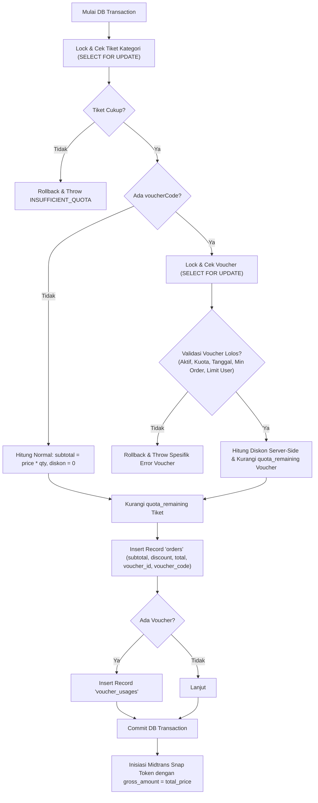
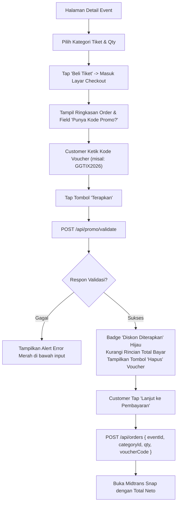

**PRD - GG Tix - Modul Promo & Voucher**  
**GGT-11 - Promo Code & Voucher Discount Engine**

| MODUL | PERSONA | PLATFORM | PRIORITAS | STATUS |
| --- | --- | --- | --- | --- |
| **Promo Code & Voucher Engine** | **Customer (Gamer/Fan), Super Admin (Marketing & Finance), Gate Staff (Read-only reference)** | **REST API (Hono + Bun) + Nuxt 4 Admin Dashboard + React Native Expo Mobile App** | **Phase 5 — High** | **Draft / Ready for Review** |

**DACI Framework**

| **Driver** | Engineering Team (Backend & Frontend) |
| --- | --- |
| **Approver** | Product Owner & Marketing Lead |
| **Contributor** | Backend Developer, Frontend Developer (Nuxt), Mobile Developer (React Native), Finance Specialist |
| **Informed** | Customer Support, Operational Lead, QA Team |

---

## Background Context

GG Tix telah berhasil mengimplementasikan penjualan tiket digital konser gaming & pop culture (Phase 1 s/d Phase 4) mulai dari manajemen master event, transaksi dengan Midtrans Snap, penerbitan QR Code e-ticket, sistem scanner check-in di venue, hingga antarmuka mobile customer.

Hingga saat ini, proses checkout di GG Tix hanya menghitung total tagihan murni dari `kategori.price * quantity`. Dalam strategi pertumbuhan platform, penetrasi pasar konser baru, dan program loyalitas komunitas gamer (misal: perilisan konser game baru, kolaborasi dengan komunitas wibu/esports, atau kampanye seasonal seperti Hari Kemerdekaan/Tahun Baru), tim marketing membutuhkan **Sistem Promo Code & Voucher Diskon**.

Fitur ini harus terintegrasi secara *foolproof*, anti-exploit, memiliki validasi kuota secara atomik (mencegah *over-claim* saat lonjakan pembelian/war tiket), mendukung pembatasan per-customer, dan tersinkronisasi akurat dengan nominal pembayaran Midtrans serta laporan finansial di dashboard admin.

---

## Problem Definition

**Apa problem / job yang dituju?**  
Belum adanya mekanisme diskon atau insentif harga berbasis kode promo di platform GG Tix, sehingga tim marketing tidak dapat menjalankan kampanye promosi, reward referral komunitas, atau early-bird discount secara terukur dan otomatis.

**Siapa yang menghadapi problem ini & seberapa penting?**  
- **Customer (Gamer/Fan)**: Menginginkan potongan harga tiket melalui event promo atau voucher apresiasi komunitas. (**Tinggi**)  
- **Super Admin / Marketing Team**: Membutuhkan sistem mandiri untuk merilis voucher dengan syarat fleksibel (nominal tetap vs persentase, batas maksimal potongan, minimal transaksi, kuota pemakaian, dan masa berlaku) tanpa campur tangan teknis developer. (**Kritis**)  
- **Finance & Operasional**: Membutuhkan kepastian bahwa nilai diskon tercatat transparan, tidak bocor/dieksploitasi bot, dan nominal yang ditagihkan ke Midtrans sesuai dengan harga akhir setelah diskon. (**Kritis**)

**Bagaimana mereka menyelesaikannya hari ini?**  
Promosi hanya bisa dilakukan dengan menurunkan harga kategori tiket secara manual di master event (`ticketCategories.price`), yang berdampak pada semua pembeli tanpa batas kuota promo khusus dan tidak memiliki data atribusi efektivitas kampanye.

**Jobs To Be Done**  
• *"Sebagai Customer, saya ingin memasukkan kode promo saat checkout tiket di aplikasi, supaya mendapatkan potongan harga yang sah dan transparan sebelum membayar via Midtrans."*  
• *"Sebagai Super Admin, saya ingin membuat dan mengatur kuota kode promo khusus event tertentu atau seluruh event, supaya kampanye promosi berjalan terukur sesuai anggaran."*  
• *"Sebagai Sistem, saya ingin memotong kuota voucher secara atomik bersamaan dengan kuota tiket dan mengembalikannya otomatis jika pesanan expired/dibatalkan, supaya kuota voucher tidak bocor."*

---

## Scope of Work

• **VOUCH-01 (Database Schema & Migration)**:  
  - Pembuatan tabel `vouchers` (kode unik uppercase, tipe diskon, nominal, min order, batas kuota, masa aktif, relasi opsional ke `events.id`).
  - Pembuatan tabel `voucher_usages` sebagai audit trail pencatatan siapa customer yang menggunakan, untuk order mana, dan berapa potongan yang diterima.
  - Enrichment kolom tabel `orders` (`subtotal_price`, `discount_amount`, `voucher_id`, `voucher_code`).
• **VOUCH-02 (Backend Promo Validation API)**:  
  - Endpoint `POST /api/promo/validate` untuk verifikasi instan kode promo sebelum checkout (cek tanggal, keaktifan, kuota sisa, minimal transaksi, kecocokan event, dan batas klaim per-customer).
• **VOUCH-03 (Checkout & Atomic Locking Integration)**:  
  - Modifikasi `POST /api/orders` pada `order.repository.ts`: integrasi lock row `vouchers` (`SELECT FOR UPDATE`), kalkulasi diskon akurat di server, pemotongan kuota voucher, dan pengiriman `totalPrice` neto ke Midtrans Snap.
• **VOUCH-04 (Auto-Refund & Rollback Lifecycle)**:  
  - Pengembalian kuota voucher (`quota_remaining = quota_remaining + 1`) dan pembatalan status pemakaian apabila order berstatus `rejected` atau `expired` (via webhook Midtrans atau cron sweep `POST /api/payments/expire-pending`).
• **VOUCH-05 (Admin Dashboard CRUD & Analytics)**:  
  - Halaman `/vouchers` pada Web Dashboard (Nuxt 4) untuk Super Admin: data table voucher, modal form tambah/edit, toggle status aktif, dan modal rincian riwayat pemakaian voucher per transaksi.
• **VOUCH-06 (Mobile Customer Experience)**:  
  - Integrasi input field "Punya Kode Promo?" pada layar `mobile/src/app/checkout/[id].tsx` dengan tombol validasi real-time, badge diskon sukses, rincian potongan harga hijau, dan opsi hapus voucher.

---

## Out of Scope

• Voucher bertingkat (*multi-voucher stacking* atau menggunakan lebih dari 1 voucher dalam 1 transaksi).  
• Sistem referral otomatis antar-customer (direncanakan pada Phase 6 Community Engine).  
• Voucher dalam bentuk cashback saldo e-wallet internal (potongan langsung pada tagihan checkout).

---

## Spesifikasi Data Model (Database Schema)

### 1. Tabel `vouchers`

```sql
CREATE TYPE discount_type AS ENUM ('fixed', 'percentage');

CREATE TABLE vouchers (
    id UUID PRIMARY KEY DEFAULT gen_random_uuid(),
    code VARCHAR(50) NOT NULL UNIQUE,                -- Disimpan uppercase, contoh: 'GGLAUNCH20'
    name VARCHAR(150) NOT NULL,                       -- Contoh: 'Diskon Opening Konser Genshin'
    description TEXT,
    discount_type discount_type NOT NULL,             -- 'fixed' (Rp) atau 'percentage' (%)
    discount_value NUMERIC(12, 2) NOT NULL,           -- Nominal Rp (misal 50000.00) atau Persen (misal 20.00)
    max_discount_amount NUMERIC(12, 2),               -- Batas maks potongan untuk persen (misal 100000.00), null jika fixed
    min_order_amount NUMERIC(12, 2) NOT NULL DEFAULT 0.00, -- Minimal subtotal transaksi
    quota_total INTEGER NOT NULL,                     -- Total batas pemakaian global
    quota_remaining INTEGER NOT NULL,                 -- Sisa kuota pemakaian (dikurangi saat checkout)
    max_usage_per_customer INTEGER NOT NULL DEFAULT 1,-- Maksimal pemakaian per akun customer
    event_id UUID REFERENCES events(id) ON DELETE SET NULL, -- NULL = berlaku semua event; Terisi = event tertentu saja
    start_date TIMESTAMP NOT NULL DEFAULT NOW(),      -- Mulai berlaku
    end_date TIMESTAMP NOT NULL,                      -- Berakhir berlaku
    is_active BOOLEAN NOT NULL DEFAULT true,          -- Toggle manual aktif/nonaktif
    created_by UUID NOT NULL REFERENCES admins(id),   -- Super admin pembuat voucher
    created_at TIMESTAMP NOT NULL DEFAULT NOW(),
    updated_at TIMESTAMP NOT NULL DEFAULT NOW()
);

CREATE INDEX vouchers_code_idx ON vouchers(code);
CREATE INDEX vouchers_event_id_idx ON vouchers(event_id);
CREATE INDEX vouchers_active_date_idx ON vouchers(is_active, start_date, end_date);
```

### 2. Tabel `voucher_usages`

```sql
CREATE TABLE voucher_usages (
    id UUID PRIMARY KEY DEFAULT gen_random_uuid(),
    voucher_id UUID NOT NULL REFERENCES vouchers(id) ON DELETE RESTRICT,
    customer_id UUID NOT NULL REFERENCES customers(id) ON DELETE RESTRICT,
    order_id UUID NOT NULL REFERENCES orders(id) ON DELETE CASCADE,
    discount_applied NUMERIC(12, 2) NOT NULL,         -- Nilai riil diskon yang didapat
    status VARCHAR(20) NOT NULL DEFAULT 'active',     -- 'active' (dipakai) | 'refunded' (order batal)
    created_at TIMESTAMP NOT NULL DEFAULT NOW()
);

CREATE INDEX voucher_usages_customer_voucher_idx ON voucher_usages(customer_id, voucher_id);
CREATE INDEX voucher_usages_order_id_idx ON voucher_usages(order_id);
```

### 3. Pembaruan Tabel `orders`

```sql
ALTER TABLE orders 
    ADD COLUMN subtotal_price NUMERIC(12, 2) NOT NULL DEFAULT 0.00,
    ADD COLUMN discount_amount NUMERIC(12, 2) NOT NULL DEFAULT 0.00,
    ADD COLUMN voucher_id UUID REFERENCES vouchers(id) ON DELETE SET NULL,
    ADD COLUMN voucher_code VARCHAR(50);
```

> **Catatan Finansial**:  
> `subtotal_price` = `category.price * quantity`  
> `total_price` = `MAX(0, subtotal_price - discount_amount)` *(Nilai ini yang ditagihkan ke Midtrans)*

---

## Aturan Bisnis & Logika Kalkulasi Diskon

| Kondisi Diskon | Rumus Perhitungan | Contoh Kasus |
| --- | --- | --- |
| **Fixed Amount (`fixed`)** | `discount = MIN(discount_value, subtotal_price)` | Nilai: Rp 50.000, Subtotal: Rp 300.000 ➔ Potongan: **Rp 50.000**, Bayar: **Rp 250.000** |
| **Percentage (`percentage`)** | `raw_discount = (subtotal_price * discount_value) / 100`<br/>`discount = max_discount_amount ? MIN(raw_discount, max_discount_amount) : raw_discount` | Nilai: 20%, Max: Rp 50.000. Subtotal: Rp 400.000 ➔ 20% = Rp 80.000. Karena melebihi Max, diskon: **Rp 50.000**, Bayar: **Rp 350.000** |
| **Bawah Batas Minimum (`min_order_amount`)** | Jika `subtotal_price < min_order_amount` ➔ **Invalid / Ditolak** | Min: Rp 200.000, Subtotal: Rp 150.000 ➔ *Error: Total belanja belum mencapai batas minimum voucher* |
| **Target Konser Tertentu (`event_id`)** | Jika `voucher.event_id IS NOT NULL` dan `order.event_id != voucher.event_id` ➔ **Invalid** | Voucher khusus "Wuthering Waves" dimasukkan saat checkout konser "Genshin" ➔ *Error: Voucher tidak berlaku untuk event ini* |
| **Batas Klaim Customer** | Hitung baris di `voucher_usages` dengan `customer_id` dan `voucher_id` yang sama berstatus `active`. Jika `>= max_usage_per_customer` ➔ **Invalid** | Maks 1x klaim, customer sudah pernah pakai di order sebelumnya ➔ *Error: Anda telah mencapai batas pemakaian voucher ini* |

---

## API Contract Specification

### 1. Validasi Kode Promo (Customer)

- **Path**: `POST /api/promo/validate`
- **Akses**: 🟣 Customer (`Authorization: Bearer <customerToken>`)
- **Request Body**:
```json
{
  "code": "GGTIX2026",
  "eventId": "c8f3b2a1-4e6d-4c8a-9f1b-0e2d3c4b5a6f",
  "categoryId": "d7e2a1f0-3b5c-4a7e-8d0c-1f2a3b4c5d6e",
  "quantity": 2
}
```

- **Response Sukses (200 OK)**:
```json
{
  "data": {
    "valid": true,
    "voucherId": "a1b2c3d4-e5f6-7a8b-9c0d-1e2f3a4b5c6d",
    "code": "GGTIX2026",
    "name": "Diskon Early Bird Komunitas",
    "discountType": "percentage",
    "discountValue": "20.00",
    "subtotalPrice": "500000.00",
    "discountAmount": "100000.00",
    "totalPrice": "400000.00",
    "minOrderAmount": "250000.00",
    "message": "Kode promo berhasil digunakan!"
  }
}
```

- **Error Codes (400 / 404 / 409 / 422)**:
```json
{
  "error": "VOUCHER_EXPIRED",
  "message": "Masa berlaku kode promo ini telah berakhir."
}
```
*Daftar Error Code*:
- `VOUCHER_NOT_FOUND`: Kode voucher tidak ditemukan atau tidak aktif.
- `VOUCHER_EXPIRED`: Waktu saat ini melampaui `end_date`.
- `VOUCHER_NOT_STARTED`: Waktu saat ini belum mencapai `start_date`.
- `VOUCHER_QUOTA_EXCEEDED`: Kuota voucher telah habis (`quota_remaining <= 0`).
- `VOUCHER_CUSTOMER_LIMIT_REACHED`: Akun customer telah mencapai batas pemakaian maksimum.
- `VOUCHER_MIN_SPEND_NOT_MET`: Subtotal pesanan kurang dari syarat minimal belanja.
- `VOUCHER_EVENT_MISMATCH`: Voucher hanya berlaku untuk konser/event tertentu.

---

### 2. Modifikasi Pembuatan Order (Checkout)

- **Path**: `POST /api/orders`
- **Akses**: 🟣 Customer
- **Request Body**:
```json
{
  "eventId": "c8f3b2a1-4e6d-4c8a-9f1b-0e2d3c4b5a6f",
  "categoryId": "d7e2a1f0-3b5c-4a7e-8d0c-1f2a3b4c5d6e",
  "quantity": 2,
  "voucherCode": "GGTIX2026"  // Optional
}
```

- **Alur Transaksi Atomik (`order.repository.ts`)**:


---

### 3. Manajemen Voucher (Super Admin API)

| Method | Endpoint | Akses | Fungsi |
| :--- | :--- | :--- | :--- |
| `GET` | `/api/vouchers` | Super Admin / Staff | List voucher dengan filter (status, eventId, search kode/nama) & pagination |
| `GET` | `/api/vouchers/:id` | Super Admin / Staff | Detail voucher lengkap dengan ringkasan metrik pemakaian |
| `POST` | `/api/vouchers` | Super Admin | Tambah voucher baru dengan validasi tanggal & kuota |
| `PUT` | `/api/vouchers/:id` | Super Admin | Update data voucher (kuota, tanggal berakhir, status) |
| `PATCH`| `/api/vouchers/:id/toggle` | Super Admin | Shortcut toggle `is_active` |
| `DELETE`| `/api/vouchers/:id` | Super Admin | Hapus voucher (hanya boleh jika belum pernah digunakan sama sekali) |
| `GET` | `/api/vouchers/:id/usages` | Super Admin / Staff | Riwayat daftar transaksi customer yang menggunakan voucher ini |

---

## User Flow & State Antarmuka

### 1. Customer Mobile Checkout Flow (React Native)



### 2. Admin Dashboard Management Flow (Nuxt 4)

1. Super Admin mengakses menu navigasi sidebar **"Promo & Voucher"** (`/vouchers`).
2. Tampil KPI ringkas di atas: Total Voucher Aktif, Total Diskon Diberikan (Rp), dan Total Transaksi Promo.
3. Tabel daftar voucher menampilkan: Kode (dengan badge copy), Tipe Diskon (Fixed / Persen), Nilai, Kuota Terpakai vs Total (`24 / 100`), Masa Berlaku, Status Aktif (Switch toggle), dan Menu Aksi.
4. Klik tombol **"Buat Voucher Baru"** membuka slideover / modal `VoucherFormModal.vue`:
   - Input Kode Voucher (Auto-uppercase).
   - Radio pilihan tipe diskon (Nominal Rupiah vs Persentase).
   - Input Maksimal Diskon (kondisional aktif jika persentase dipilih).
   - Input Minimal Pembelian.
   - Pilihan cakupan event: "Semua Konser" atau pilih spesifik event dari dropdown.
   - Date range picker (Tanggal Mulai s/d Tanggal Berakhir).
   - Kuota Total & Batas Pemakaian per User.

---

## Forecasted Impact Metrics

- **Peningkatan Konversi Checkout (Conversion Rate)**: Meningkat **≥ 25%** pada periode kampanye peluncuran konser game baru.
- **Rata-rata Nilai Transaksi (Basket Size)**: Peningkatan kuantiti tiket per-order **≥ 15%** berkat insentif *minimum order amount*.
- **Keamanan & Konsistensi Finansial (Zero Over-Selling/Over-Discounting)**: **0 kasus** kebocoran kuota voucher (*zero double-claim* / *race condition*).
- **Efisiensi Operasional Tim Marketing**: Waktu pembuatan dan aktivasi promo berkurang dari sebelumnya 2 hari kerja (lewat request developer) menjadi **< 3 menit** secara mandiri via dashboard admin.

---

## User Stories & Acceptance Criteria

| User Story | Acceptance Criteria | Est Points | Modul |
| :--- | :--- | :---: | :---: |
| Sebagai **Customer**, saya ingin memasukkan kode promo saat checkout agar bisa menikmati potongan harga tiket. | - Field input kode promo tersedia di halaman checkout mobile dan web.<br/>- Terdapat validasi real-time via `POST /api/promo/validate`.<br/>- Jika valid, rincian potongan harga dan total baru langsung ditampilkan.<br/>- Jika tidak valid, pesan error yang informatif tampil di bawah input.<br/>- Customer dapat membatalkan/menghapus voucher sebelum lanjut bayar. | 5 | VOUCH-02, VOUCH-06 |
| Sebagai **Sistem**, saya ingin mengunci kuota voucher secara atomik saat pembuatan order agar tidak terjadi over-claim. | - `order.repository.ts` menggunakan transaksi database dengan `SELECT FOR UPDATE` pada baris voucher.<br/>- `quota_remaining` berkurang tepat sesuai penggunaan.<br/>- Transaksi di-rollback jika kuota voucher habis pada milidetik yang sama.<br/>- Record tersimpan di `voucher_usages`. | 8 | VOUCH-01, VOUCH-03 |
| Sebagai **Sistem**, saya ingin mengembalikan kuota voucher jika pesanan kedaluwarsa atau ditolak admin. | - Saat order berubah menjadi `rejected` atau `expired`, `quota_remaining` voucher ditambah kembali 1.<br/>- Status di `voucher_usages` diperbarui menjadi `refunded`.<br/>- Customer dapat menggunakan kembali kuotanya jika belum melewati masa berlaku. | 5 | VOUCH-04 |
| Sebagai **Super Admin**, saya ingin membuat dan mengelola voucher promo di dashboard agar bisa mengatur promosi fleksibel. | - Menu "Promo & Voucher" tersedia di admin dashboard Nuxt 4.<br/>- Form pembuatan mendukung tipe diskon nominal dan persentase.<br/>- Bisa membatasi voucher hanya untuk konser tertentu atau semua event.<br/>- Bisa mengatur tanggal mulai, berakhir, kuota total, dan limit per akun.<br/>- Switch toggle aktif/nonaktif dapat diubah instan. | 8 | VOUCH-05 |
| Sebagai **Gate Staff**, saya dilarang membuat atau mengedit voucher promo. | - Rute `/vouchers` diblokir untuk role `gate_staff` (HTTP 403 & redirect otomatis).<br/>- Menu voucher disembunyikan dari sidebar gate staff per PRD GGT-08. | 2 | VOUCH-05 |

---

## Wording (Microcopy)

| Kondisi / Lokasi | Teks Tampilan (Bahasa Indonesia) | Tipe |
| :--- | :--- | :--- |
| **Input Voucher (Placeholder)** | `"Masukkan kode promo (misal: GGTIX2026)"` | Placeholder Input |
| **Tombol Terapkan** | `"Terapkan"` | Button |
| **Voucher Sukses Diterapkan** | `"Kode promo berhasil digunakan! Hemat [Nominal]"` | Success Badge / Toast |
| **Tombol Hapus Voucher** | `"Hapus"` | Text Button |
| **Error: Kode Tidak Ditemukan** | `"Kode promo tidak ditemukan. Periksa kembali penulisan kode Anda."` | Field Error |
| **Error: Kuota Habis** | `"Yah, kuota promo ini sudah habis terpakai."` | Field Error |
| **Error: Kedaluwarsa** | `"Masa berlaku kode promo ini telah berakhir."` | Field Error |
| **Error: Belum Mencapai Min. Belanja** | `"Minimal pembelian untuk promo ini adalah Rp [Nominal]."` | Field Error |
| **Error: Limit Akun Tercapai** | `"Anda telah mencapai batas pemakaian untuk kode promo ini."` | Field Error |
| **Error: Salah Event** | `"Kode promo ini tidak berlaku untuk konser yang dipilih."` | Field Error |
| **Rincian Diskon di Nota/Order** | `"Potongan Promo ([KODE])"` | Summary Row |

---

## Tech Stack & File References

| Layer / Kebutuhan | File / Komponen Codebase | Catatan Implementasi |
| :--- | :--- | :--- |
| **Database Schema** | `backend/src/db/schema.ts` | Tambah tabel `vouchers`, `voucher_usages`, dan alter `orders`. |
| **Database Migration** | `backend/drizzle/` | Generate migration SQL baru via `bun x drizzle-kit generate`. |
| **Validation Schema** | `backend/src/routes/promo.ts` | Zod schema validasi payload customer & admin. |
| **Service & Repository** | `backend/src/services/promo.service.ts`<br/>`backend/src/repositories/promo.repository.ts` | Kalkulasi diskon, lock atomik, dan rollback kuota. |
| **Order Integration** | `backend/src/services/order.service.ts`<br/>`backend/src/repositories/order.repository.ts` | Hubungkan pemotongan voucher dalam transaksi `createOrder`. |
| **Refund Hook** | `backend/src/services/payment.service.ts` | Trigger rollback kuota pada webhook gagal / `expireOverduePendingOrders`. |
| **Admin Web Panel** | `frontend/app/pages/vouchers/index.vue`<br/>`frontend/app/components/VoucherFormModal.vue` | Nuxt 4 + Nuxt UI (Data table, modal, badges). |
| **Admin Navigation** | `frontend/app/layouts/default.vue` | Tambah menu sidebar dengan proteksi RBAC Super Admin. |
| **Mobile Checkout UI** | `mobile/src/app/checkout/[id].tsx` | Input promo code, API call, dan update rekap harga pembayaran. |

---

> **Dokumen Terkait:**
> - [Dokumen Konsep Lengkap GG Tix](./GG%20Tix%20-%20Dokumen%20Konsep%20Lengkap.md)
> - [Backend API Contract - Panduan Integrasi Frontend](./Backend%20API%20Contract%20-%20Panduan%20Integrasi%20Frontend.md)
> - [GGT-06: Midtrans Payment Gateway Integration](./GGT-06%20-%20Midtrans%20Payment%20Gateway%20Integration.md)
> - [GGT-08: Role-Based Access Control & Gate Staff Operational Management](./GGT-08%20-%20Role-Based%20Access%20Control%20%26%20Gate%20Staff%20Operational%20Management.md)
> - [GGT-09: Mobile App Customer Experience (React Native Expo)](./GGT-09%20-%20Mobile%20App%20Customer%20Experience%20%28React%20Native%20Expo%29.md)
